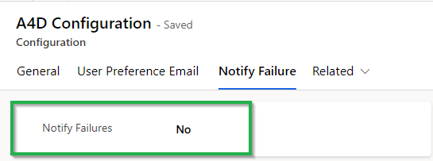
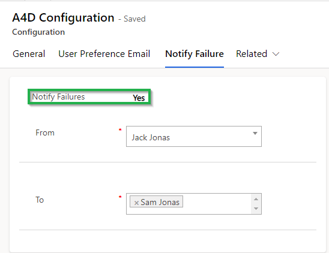

# Notify Failure

Notify failure will notify the defined users in **‘Notify Failure’** setting if there are any failure during creation of notification like incorrect configuration or other similar reasons.&#x20;

If there are any notification failures, then daily a mail will be sent out to the defined users in the setting. Given below is the step to enable notify failure:&#x20;

When the user clicks on the **‘Activate’** button on License Registration form, **‘Configuration Record**’ is automatically created and becomes visible under **‘Configuration’** entity of Alerts4Dynamics.&#x20;

After the creation of that record, user can set the Notify Failure (two Options field) value Yes or No in that record.&#x20;

By default the field is set as ‘No’, which means no notification mails about the error logs will be sent.

<figure><figcaption></figcaption></figure>

When **‘Yes’** option is selected, user can see two fields **‘To’** and **‘From’** which defines to whom the error logs will be send and from whom they will receive the error logs. Here, the error logs contain all the failures in Alerts4Dynamics process and its details in a table format. The error logs will be sent daily at **12:00 am** to users mentioned in **‘To’** field.

<figure><figcaption></figcaption></figure>
