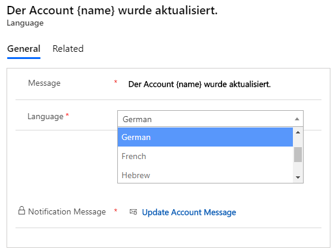

# Alert in Multiple Languages

Every Message can have multiple languages if they are enabled by the user in CRM. There are **two** ways to create Notification Message (Language) for Message record.

1. When the user saves a Message, the Language record is automatically created and appears in Notification Message Sub-Grid.
2. After Message record is created, and user needs to add another language record (which should be different from the existing one). Click on **‘+ New Language’** button on Sub-Grid and Language form will be displayed and you can create a new Notification Message (language) for that particular record.

Similarly, Notification Message record can be **Updated** in two ways:

* Change the **‘Message Text’** field in the Message record will update the respective Notification Message record as it is in the **‘Language’** field of that Message record.

* Select the Notification Message from its Sub-Grid in Message record and click on the **‘Edit’** button. Notification Message record form will be opened and you can edit the message from that form.

.png>)


**Note: The ‘Message Text’ and ‘Language’ fields will get reset post deleting the respective Notification Message (Language) record (these two fields will reset only after the user refreshes the message record page).**


For example, for Multi-Language message, consider there are total three users in the organization out of which one user have **German** language enabled as his CRM’s User Interface Language. Alerts4Dynamics gives a provision through which alert message can be added in user’s preferred language (German in this example) to be shown to the respective user. In addition, the users that do not have a **‘German’** language enabled as their CRM's User Interface language will not be able to see the German message.

