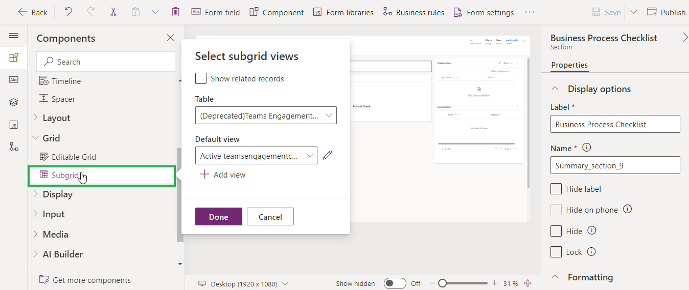

# Event-Based Alert

Alerts4Dynamics gives user a provision to show an alert with respect to any event that happens in the CRM. There are two types of Event-Based Alerts.

1. **The Entity on which the notification to be shown is same as the entity where the workflow is triggered.** For example, user wants to create Event-Based Alert to notify all users across about the creation of new record within the selected entity in CRM. To know step-by-step configuration, please [click here](https://docs.inogic.com/alerts4dynamics/configuration/record-based-alert/event-based-alert).
2. **The entity on which the notification to be shown is different from the entity where the workflow is triggered.** Here, further the notification audience and email audience can be the related records which are in **‘One to Many’** or **‘Many to Many’** relationships. For **‘Many to One’** relationships the audience can be defined by using the default form assistant available in OOB workflows.

**Now let’s consider the below scenario for the second type of Event-Based Alerts:**

There is an invoice with a related account which has further multiple associated contacts and user wants to show the notification as well as send an email to these contacts once the invoice is paid. For this, we will configure the workflow as shown below:

* Navigate to **Advanced Settings** --> **Processes** --> **New Process** --> **Fill the fields** --> Click on **OK.**

* Since we want to trigger an alert on status change event of an invoice (i.e. when invoice is paid), we will enable the **‘Record status changes’** checkbox.

* Now, add a step and check the condition if the invoice is paid.

* Here, we will check the condition whether the invoice status has been paid, you can similarly define any condition.

* Now click on **‘Save and Close’**.

* Add another step under the above added step and select **‘Create Record’.**

* Select **‘Notification Request’** for record creation and click on **‘Set Properties’.**

* Fill the following fields:&#x20;
  * **Name** – Enter some valid name for the message.&#x20;
  * **Message Text** – Enter a text for the message that you would like to display on the alert notification. Let’s say, we would like to show the invoice name in the message. For this we’ll select a dynamic field from the list.
  * **Message Rich Text –** Select the appropriate Message Rich Text from the lookup.&#x20;


**Note:**&#x20;

* **If both Message Text and Message Rich Text fields are filled, then preference will be given to Message Rich Text when displaying the notification.**
* **Message Rich Text cannot be displayed as a bar in a form notification.**
* **To add Message Rich Text in Event-Based Alerts you need to create messages text before creating the workflow using "Message Texts" of Alerts4Dynamics App.**&#x20;


* Click on **‘Add’** and Next, fill the following fields:&#x20;
* **Alert As** – Since we want to send an alert through an email, we will select it as **‘Email notification’.**&#x20;
* **Alert level** – Let’s say it is just a normal informational alert, we will select it as ‘**Information’**.
* Populate the field **‘Notification Associated with’ f**ield. Since this alert is associated with **‘Invoice’** but we want a notification to be shown on the related Account, we will select the Record URL of the **Account** entity and **not** of the **Invoice**.


**Note**: **We support N:1 relationship to show notification on related entity record. For example, you can show all active cases notification on the related account record**


* This will set the field with value as shown below:

<figure><figcaption></figcaption></figure>

* Now we will define the email recipient and select the user from whom you would like to send an email notification. Click on the below look-up field. In this scenario we will set the Notification Audience section blank. Hence, the notification will be displayed to all the users in the CRM.
* **‘To – Same As Include Users’** : If we have selected the include users and want the same audience to be carry forwarded for the email audience as well, then in such scenario we would have to just set the field to ‘**Yes**’, as by default is set to **‘No’.**

* Select the user that you would like to send an email notification from and click on **‘Add’**.

* Select the **‘to’** recipient and click on ‘**Add’.**

* Here, we want to send the email notification to all the contacts that are associated with **‘Account’**, so we will select the primary entity as **‘Account’** and select **‘Record URL (Dynamic)’** from the list. Similarly, we can select any related entity as shown in the below image.

* Next step is to define the related recipients for receiving the email notification. For this, you will have to enter a logical name of 1:N relationship that account holds with contact. **Navigate to Advanced Settings --> Customizations -->Customize the system.**
* Look for Account entity --> 1:N relationship.

* Look for the below relationship and open it.

* Copy the name of the relationship.

* Now, navigate back to properties page and paste the name of this relationship into the below field. Similarly, if you want the audience to be of type more than one relationship then you can define multiple relationship as comma separated.

* Enter a valid subject and relevant message for an email.

* Once this is done, click on **‘Save and Close’**.

* Next, click on **‘Save’** and the activate the workflow.


For any queries, reach out to us at [crm@inogic.com](mailto:crm@inogic.com)


