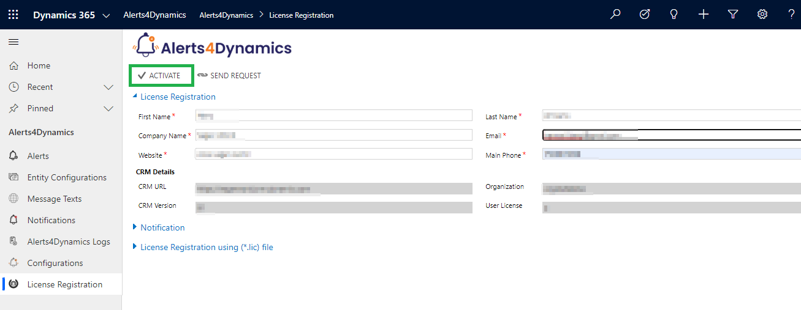

# License Activation

Before using the solution, it is important to complete the process of **License Activation.**

Here are the steps to activate **Alerts4Dynamics** license.

* Navigate to **Dynamics 365** --> **Alerts4Dynamics** app.&#x20;

<figure><figcaption></figcaption></figure>

* Go to **License Registration**.

.png>)

Enter the Details: First Name, Last Name, Company Name, Email, Website and Main Phone --> Click on **ACTIVATE**.

If you want to purchase or extend the trial, click on **SEND REQUEST** --> Enter all details --> Click again on **SEND REQUEST** and send the email to Inogic.\

.png>)

### Alternate method to complete License Activation __&#x20;

Here are the steps to complete registration through the **‘License Registration using (\*.lic) file’** section.

* Request .lic file from Inogic --> Save file --> Go to **Alerts4Dynamics** app --> **License Registration** --> Click **Choose File** to locate the file with the extension .lic

* Select the file --> Click **Open**.

<figure><figcaption></figcaption></figure>

* Click on **Register** to complete the **License Registration**.

.png>)


For any queries, reach out to us at [crm@inogic.com](mailto:crm@inogic.com)

