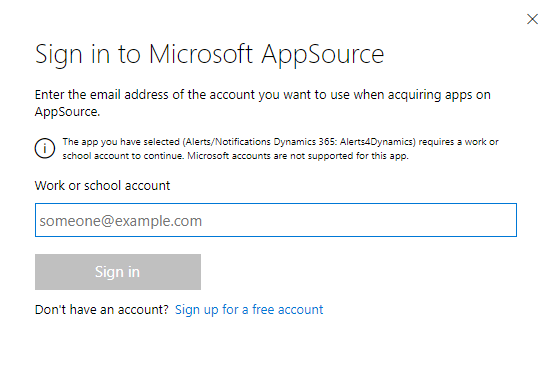
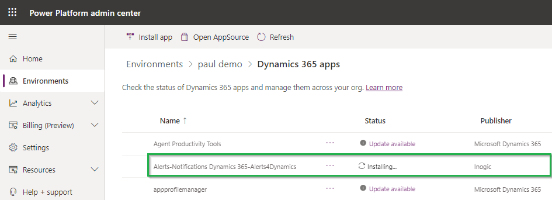

# Install from Microsoft AppSource

To install **Alerts4Dynamics** solution from the **Microsoft AppSource**, visit the [link](https://appsource.microsoft.com/en-us/product/dynamics-365/inogic.alerts-4-dynamics-add-manage-schedule-notification?tab=Overview) and go through the steps shown below.&#x20;

* Click on the **FREE TRIAL** button.

<figure><figcaption></figcaption></figure>

* If the user is already logged into CRM, accept the terms & conditions and click on **Free Trail**.

<figure><figcaption></figcaption></figure>

* If the user is not logged into CRM, fill in the credentials and **Sign in**.

* Next, confirm the details in the form, accept the terms & conditions and click on **Continue**.

* Select your environment from the dropdown list and accept the privacy policies & legal terms. Then click on the **Install** button for the installation to start.

<figure><figcaption></figcaption></figure>

* The installation process will now have started and you can check the status by refreshing the page.

<figure><figcaption></figcaption></figure>

* After the installation is done, you will be able to see **Alerts4Dynamics** solution in **My apps**.

<figure><figcaption></figcaption></figure>
