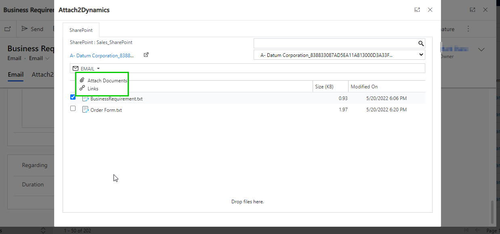
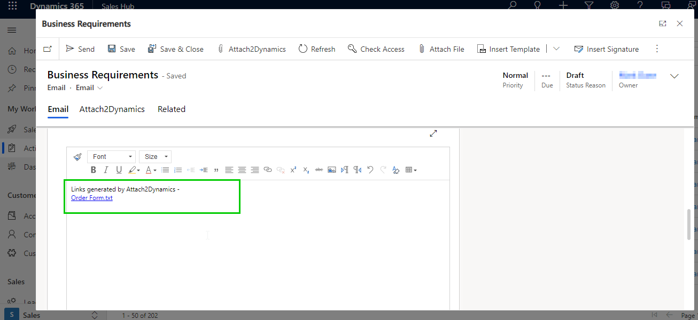

# FAQs

## 1) How can you move history attachments?

With the use of Attach2Dynamics feature called [Bulk Migration](https://docs.inogic.com/attach2dynamics/features/bulk-migration-job) job, you can move your historical notes/email/sales literature attachments.

## 2) How to enable file deletion?

To enable file deletion, you need to create [Security Template](https://docs.inogic.com/attach2dynamics/features/security-templates) with required actions.&#x20;

## 3) We have done a sandbox copy of the production environment to a TEST env. and like to have the 'Attach2Dynamics' solution to work in this new instance. What do we need to do?

You need to delete the Inogic License Details record from your sandbox environment. After deleting the next step would be to [activate the license](https://docs.inogic.com/attach2dynamics/getting-started/license-activation).

To delete the Attach2Dynamics license follow the below steps:

Step 1: Navigate to **Advanced Find.**

.jpg>)

Step 2: Select **Inogic License Details** in **‘Look for’** and click on **Results** button.

.jpg>)

Step 3: Select the **Attach2Dynamics** record and **delete** it.

.jpg>)

## 4) I get the following error while creating an anonymous link of file on Attach2Dynamics UI, how can I resolve this?

This error is due to insufficient permissions on SharePoint. So, you need enable some settings in SharePoint. For more details, please click [here](https://docs.inogic.com/attach2dynamics/prerequisites/untitled).

## 5) Is it possible to connect with multiple cloud storage?

Yes, you can connect with multiple cloud storage. For this, you have to create different connectors depending upon each cloud storage.

## 6) After importing the solution of Attach2Dynamics from website all the Processes of Attach2Dynamics are in a 'Draft/Deactivated' state. What to do?

Once the solution is imported, please follow the below steps to activate all the processes of Attach2Dynamics.

* Click on the **gear icon** at the top right --> Select **Advanced Settings**.

* Then select **Processes**.

* From **All Process View** activate the process shown in the below screenshot.

## 7) What to do if I am unable to authenticate the connector?

In such situations, please ensure the credentials are correct and you have a Global administrator privileges and also are a SharePoint site owner.

## 8) I am getting an error pop-up stating ‘Unable to get Tokens’. What should I do?

Firstly, please check if the browser setting is to Enable the cookies. To know more please follow this [link](https://docs.inogic.com/attach2dynamics/how-to-guides/enable-cookies-setting). If the solution still doesn’t work please then try to authenticate the connector once. If you are using **Authentication mode** as **App** then please make sure that you have selected the consent box while authenticating. Please follow this [link](https://docs.inogic.com/attach2dynamics/configuration/connector-configuration/sharepoint#app) to know about how to authenticate the connector.

## 9) What to do if I get ‘Active user count exceeds the user limit’ error?

This message is displayed when the number of the CRM user is increased beyond the subscribed users. If you get this issue then please reach out to us at [crm@inogic.com](mailto:crm@inogic.com) with the total user count. To get the total user count please execute the below condition in **Advanced Find**:

.png>)

## 10) What to do if I am not able to see the Attach2Dynamics button?

Please make sure the user has Attach2Dynamics Admin / User security role assigned. To know more about the Attach2Dyamics security role please follow this [link.](https://docs.inogic.com/attach2dynamics/getting-started/set-up-security) Also, please make sure the Entity configuration record is created for the respective entity. To know more about entity configuration please follow this [link.](https://docs.inogic.com/attach2dynamics/configuration/entity-configuration)

## 11) Can Attach2Dynamics UI be shown on a Tab instead of clicking the Attach2Dynamics button?

Yes, Attach2Dynamics can be shown on a tab. To know more regarding the configuration please follow this [link.](https://docs.inogic.com/attach2dynamics/configuration/iframe-configuration)

## 12) I cannot see Ribbon buttons on Connector entity post import of Attach2Dynamics solution. What to do?

Sometimes when you install a Managed solution it takes time for the ribbon buttons to appear. In such situations, please wait for some time and then you will be able to see the buttons.

## 13) I changed my Microsoft account password after which I started facing an issue while using Attach2Dynamics solution. What to do?

In order to solve this issue, you will have to delete the connection detail record of the user who is this getting error.

To delete the connection detail record of the user please follow the steps given below:

* Open **Advanced Find** from your CRM.

.jpg>)

* In the **Look for** dropdown select **Connection Details** entity.

.jpg>)

* Please add a condition as shown in the below screenshot:

* Click on **Results.**

* Select all the records of that user --> Click on **Delete.**

* Once the record is deleted, authenticate all the connectors and then hit the **Attach2Dynamics** button.

## 14) Is the versioning feature in Azure Blob storage supported in Attach2Dynamics?

Yes, Attach2Dynamics does support the versioning feature in Azure Blob Storage. However, for the versioning feature to work, the versioning needs to be enabled in the **Azure Blob** **properties**.

Kindly follow the below steps to enable the versioning feature in Azure Blob Storage:&#x20;

* Navigate to [https://portal.azure.com/](https://portal.azure.com/)
* Click on **Storage Accounts.**

* Select the **Storage Account** --> Click on **Data Protection.**

* Check the **Enable versioning for blobs** checkbox and click on the **Save** button.

After enabling the above property, the versioning functionality will start working just as shown in the below example:

* Navigate to **Attach2Dynamics** App --> **Entity Configurations** --> Open Account entity configuration -->Enable **Override files** --> Click on **Save**.

* Navigate to **Sales Hub** --> **Accounts** --> Open **any account record** --> Click on **Attach2Dynamics** button.

* Upload any file by clicking on the **Upload** button in Attach2Dynamics UI and then again **upload** the same file with the same name but different content.

* Now, navigate to the **Azure Portal** --> **Storage Accounts** --> **Containers** --> **Account** --> Open the Account for which you have uploaded the file in Attach2Dynamics UI.

* To check the previous versions, click on the file which you have uploaded (“Order Form.txt” in this case), and under the **Versions** tab, you will be able to see the previous versions.

* Also, you can select the **previous version** and click on the **Download** **Version** button to download the previous version files.

## 15) Is there a way to use Attach2Dynamics in offline mode?

Yes, you can use the **Real-time sync** feature of Attach2Dynamics to migrate uploaded documents to SharePoint in offline mode. Please follow this [link](https://www.inogic.com/blog/2022/03/how-to-enable-model-driven-apps-for-offline-use/) to enable the offline mode. For attachment migration, you will need to configure the Entity configuration for the respective entity and set the attachment action as either **Move** or **Copy**. When the offline mode is enabled, the note attachment will not get migrated. Once the user connects back with the mobile data or Wi-Fi, the note attachment will get migrated to the SharePoint/Azure Blob/Dropbox.

Please follow the steps given below to achieve the offline capability for the Note attachment with the associated account entity.

* First, enable the offline mode in your CRM. Please follow this [link](https://www.inogic.com/blog/2022/03/how-to-enable-model-driven-apps-for-offline-use/) for enabling the offline mode in your CRM.&#x20;
* Once you have enabled the offline mode in your CRM, open the Dynamics 365 App on mobile --> Login with the credentials -->Navigate to **Sales Hub -->Account**.

* Open any account record -->Click on the **+ icon** in the timeline of the account record.

* Select **notes** and **add** an attachment -->Click on **Add note** in the timeline and the note attachment will get added to the timeline.


**Note: Entity configuration must be created for the Account entity and attachment action should be either Move or Copy.**


.png>)

* Once you connect back with your network connectivity, the note attachment which is added on the account record will get migrated to SharePoint and the link will get generated in the timeline.

## 16) **How to fix the following error 'No reply address is registered for the application'?**

This issue occurs when the Redirect URL has not been added in the **** redirect section of the Azure App as shown in the below image:

Please follow the below steps to add a redirect URL:

* Navigate to **Azure App** --> Click on **Redirect URL**.

.jpg>)

* Click on **Add a platform** button --> Select **Web**.

* Add the Redirect URL.


**Note: To identify the Redirect URL, kindly navigate to the Attach2Dynamics App-> Connectors-> Credentials tab and copy the redirect URL which is highlighted in the below screenshot:**


* After adding the redirect URL, click on **Configure** button.

* Navigate to **Attach2Dynamics App** -> **Connectors** --> **Authenticate** the connector again.

To know more about this, kindly follow this [link](https://docs.inogic.com/attach2dynamics/configuration/connector-configuration).

## 17) What is the difference between Attach2Dynamics and SharePoint Security Sync?

<figure><figcaption></figcaption></figure>
