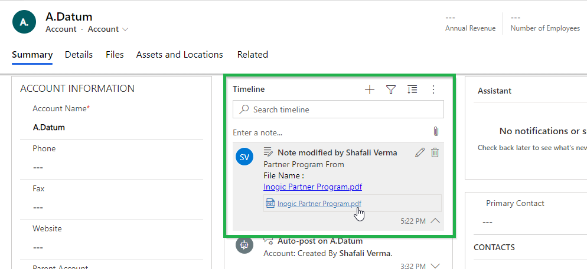

# Move/Copy Attachments

Users can move/copy Dynamics 365 CRM Notes Attachments/Email Attachments and Sales Literature Attachments to Dropbox, SharePoint or Azure Blob Storage on real time.

**Move:** You will be able to move all the attachments to the cloud storage of your choice.

**Copy:** You will be able to make a copy of the attachments and move it to the cloud storage of your choice.&#x20;

In order to achieve this it is necessary to configure entities. For detailed steps click [here](https://docs.inogic.com/attach2dynamics/configuration/entity-configuration).

**Notes Attachments:** If enabled, it’ll move/copy the Note Attachments to the respective entity folder and leave a a hyperlink of the path in Note Body.

.png>)


**Note:**

* **It is necessary to create Entity Configurations to move** [**Email** ](https://docs.inogic.com/attach2dynamics/configuration/entity-configuration#email-attachments)**&** [**Sales Literature** ](https://docs.inogic.com/attach2dynamics/configuration/entity-configuration#sales-literature-attachments)**Attachments to the cloud storage of your choice.**
* **Real-time Migration supports all non-activity entities and activity entities i.e. Email and Appointment.**


**Email Attachments:** If enabled, it’ll move/copy the Email Attachments to a common folder called Email Attachments or Regarding folder and leave a hyperlink of the path in Note Body.

.png>)

.png>)

**Sales Literature Attachments:** If enabled, it’ll move/copy the Sales Literature Attachments to the respective Sales Literature folder and leave a hyperlink of the path back in Cloud Storage Links section. You can view the moved file from Attach2Dynamics UI.

