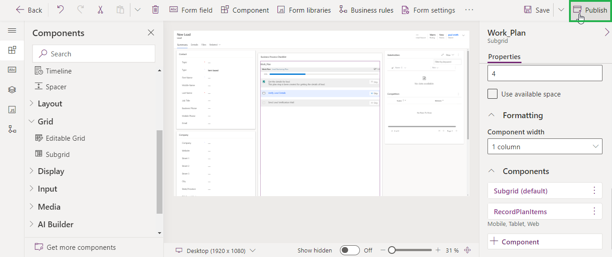

# License Activation

One of the most important steps after installing the solution is to activate the license.

Follow the steps below for hassle-free license activation.

* Navigate to Dynamics 365 --> Attach2Dynamics app.

.png>)

* Go to License Registration.

.png>)

Enter the Details: First Name, Last Name, Company Name, Email, Website and Main Phone --> Click on ACTIVATE.

If you want to purchase or extend the trial, click on SEND REQUEST --> Enter all details --> Click again on SEND REQUEST and send the email to Inogic.

.png>)

### Alternate method to complete License Activation __&#x20;

Here are the steps to complete registration through the **‘License Registration using (.lic) file’** section.

* Request .lic file from Inogic --> Save file --> Go to Attach2Dynamics app --> License Registration --> Click ‘Choose File’ to locate the file with the extension .lic

.png>)

* Select the file --> Click ‘Open.’

* Click on ‘Register’ to complete the License Registration.

.png>)
