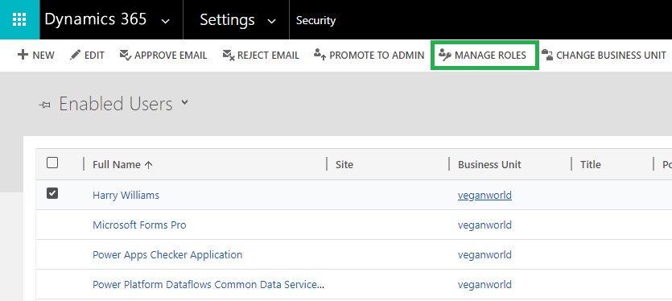

# Set up Security

**Attach2Dynamics** has the following security roles:



**Attach2Dynamics Administrator** has the privilege to create and modify '**Entity Configurations**' and '**Connector**' entity records.



**Attach2Dynamics User** will be able to use **Attach2Dynamics features** but is not allowed to create **'Entity Configurations'** or **'Connector Records'.**




**Note: It is necessary to assign any one of the above security roles to use Attach2Dynamics Solution**


Follow the steps below to assign security roles to users.

* Go to **Advanced Settings** --> **Settings** --> **Security**.

.png>)

* Select **Users**

.png>)

* Select user --> Click on **Manage Roles**

* Click on any one of the security roles --> Click **Ok**.

.png>)


For any queries, reach out to us at [crm@inogic.com](mailto:crm@inogic.com)

