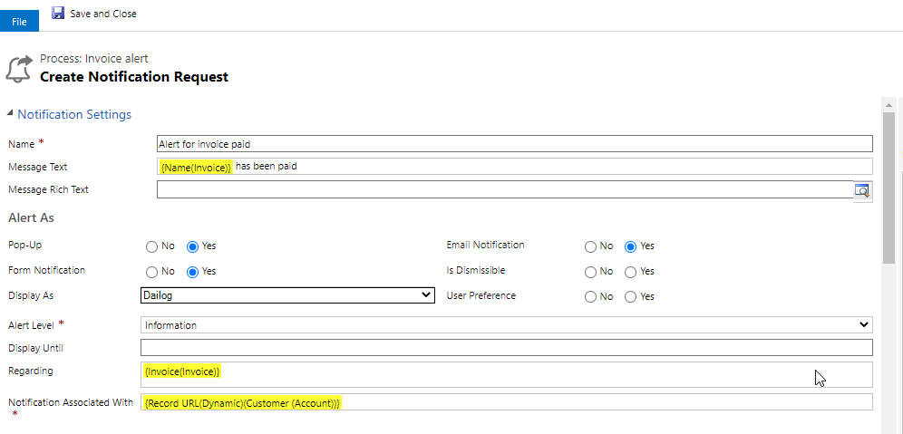

# Install from Microsoft AppSource

Visit the [link](https://appsource.microsoft.com/en-us/product/dynamics-365/inogic.a25a8d99-d517-734c-b754-6d7f0a82d7b6) and follow the steps shown below to install **Attach2Dynamics** from Microsoft AppSource easily.

* Click on the **FREE TRIAL** button.

.png>)

* If the user is already logged into CRM, accept the terms & conditions and click on '**Continue**'.

.png>)

* If the user is not logged into CRM, fill in the credentials and Sign in.

.png>)

* Next, confirm the details in the form, accept the terms & conditions, and click on '**Continue**'.

* First, select the environment from the list then accept the privacy policies & legal terms by clicking on the checkboxes. Proceed to the installation by clicking on the **Install** button.

.png>)

* The installation process will now have started and you can check the status by refreshing the page.

.png>)

* After the installation is complete, you will be able to see **Attach2Dynamics** solution in 'My apps'.

