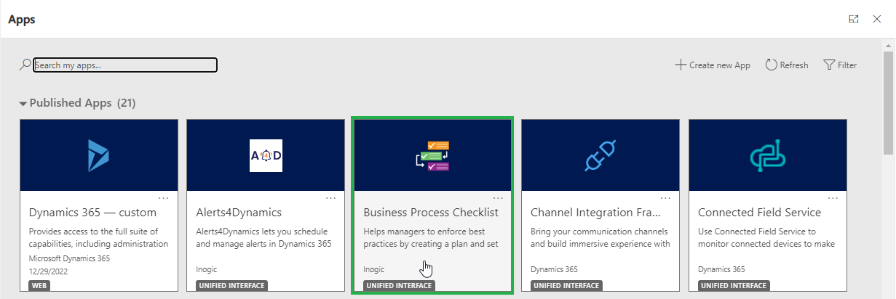

# Install from Website

**Attach2Dynamics** can be installed from our website in two different ways as shown below:

### Using Power Apps UI

To import the solution from make.powerapps.com, download the Attach2Dynamics solution from our [website](https://www.inogic.com/product/productivity-apps/attach-2-dynamics-365-crm-upload-multiple-files-sharepoint-cloud-storage). Then follow the steps as shown below:

* Sign in to [Power Apps](https://make.powerapps.com/?utm\_source=padocs\&utm\_medium=linkinadoc\&utm\_campaign=referralsfromdoc). After signing in, select the instance on which you want to install the solution.

.png>)

* From the left navigation, click on **Solutions** as shown below.

.png>)

* Click on **Import** on the command bar.

.png>)

*
  On the **Import a solution** page, select **Browse** to locate the previously downloaded compressed (.zip) file that contains the solution.

.png>)

.png>)

* Select **Next**.

.png>)

* Then click on **Import**.

* Your solution will get imported. To check the status of the installation, refresh the page.

### Using Classic UI

Installation of Attach2Dynamics solution is very easy, download the solution from the [website ](https://www.inogic.com/product/productivity-apps/attach-2-dynamics-365-crm-upload-multiple-files-sharepoint-cloud-storage)and then import the managed solution to your CRM environment.&#x20;

Follow the steps to import and install **Attach2Dynamics** solution.

* Navigate to Advanced Settings on Gear Icon on top right to import the solution.

.png>)

* Navigate to Settings --> Solutions.

.png>)

* Click on Import.

.png>)

* Browse the downloaded file.

.png>)

* Check ‘Enable any SDK message processing steps included in the solution’ and proceed to import the solution.

.png>)

###
