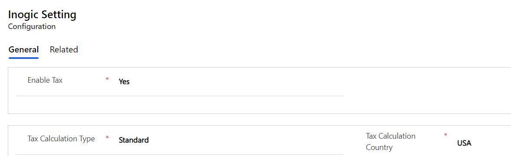

# Configuration

Once the license is activated for Auto Tax Calculator, a record named **‘Inogic Setting’** is created under Configurations. The Inogic Setting entity stores the details about which type of tax calculation the user wants to use to calculate tax.

You will find the following fields in **Inogic Settings**:&#x20;

* **Enable Tax:** This is a two option set field. It is a Global Setting to turn On/Off calculation of tax using Auto Tax Calculator. If ‘Yes’ then tax is calculated using Auto Tax Calculator.&#x20;
* **Tax Calculation Type:** This is an optionset field with the following options – [**Standard**](https://docs.inogic.com/auto-tax-calculator/configuration/standard) **and** [**Avalara**](https://docs.inogic.com/auto-tax-calculator/configuration/avalara)**.** Here, in ‘Standard’ the tax calculations are done based on the Tax Schedules created in the system and in ‘Avalara’ tax is calculated based on the tax rates defined in the Avalara system.

Auto Tax Calculator enables users to calculate tax automatically for OOB entities like Opportunity, Quote, Order and Invoice. After the Auto Tax Calculator is imported into the CRM system, you will get two additional Custom entities – [**Tax Schedules**](https://docs.inogic.com/auto-tax-calculator/configuration/tax-schedules) **and** [**Locations.**](https://docs.inogic.com/auto-tax-calculator/configuration/locations)****

Let's see in detail about these entities in the coming sections.
