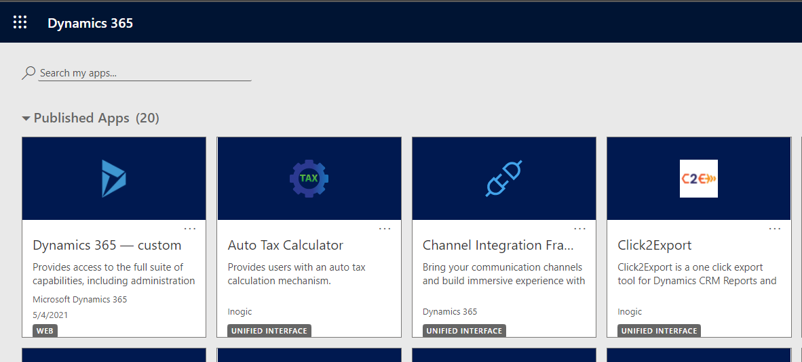

# License Activation

The first and foremost step after installing solution is License Activation.

Here are the steps to activate **Auto Tax Calculator** license.

* Navigate to Dynamics 365 --> **Auto Tax Calculator** app.

* Go to **License Registration**.

* Enter the Details: **First Name, Last Name, Company Name, Email, Website, and Main Phone** --> Click on **ACTIVATE**.

* If you want to purchase or extend the trial, click on **SEND REQUEST** --> Enter all details --> Click again on **SEND REQUEST** and send the email to Inogic.

### Alternate method to complete License Activation __&#x20;

Here are the steps to complete registration through the **‘License Registration using (.lic) file’** section.

* Request **.lic file** from Inogic --> Save file --> Go to Auto Tax Calculator app --> License Registration --> Click ‘**Choose File**’ to locate the file with the extension **.lic**

.png>)

* Select the file --> Click ‘**Open**.’

.png>)

* Click on ‘**Register**’ to complete the License Registration.

