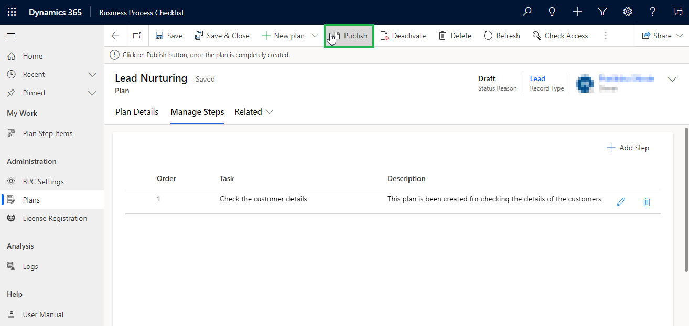

# Plan Step

Plan steps are tasks that are needed to be performed to carry out a plan effectively. There are no plan step actions/activities to perform under tasks/plan steps in a Checklist-Type plan.

In a Checklist-Type plan, the plan steps help managers define what a task is and why it needs to be performed.

To create **Plan Steps**, follow the steps given below:

* Once the plan is created, navigate to **Manage Steps**.

<figure><figcaption></figcaption></figure>

* Click on the **Create Plan Step** button.

<figure><figcaption></figcaption></figure>

* This will open the **‘Quick Create Form: Plan Step’,** where we need to fill in the details**.**
  * **Name:** Provide an appropriate name for the Plan Step.
  * **Description:** Provide a short description of the Plan Step.
* Once the required fields are filled, click on **‘Save and Close’**

<figure><figcaption></figcaption></figure>

* Your plan step will be added to the checklist and appear on Plan Steps.

<figure><figcaption></figcaption></figure>

* Similarly, we can add more steps, by clicking on the **'Add Step'** button as shown below.&#x20;

<figure><figcaption></figcaption></figure>

* **Click** on **Publish** to publish the plan.


**Note: At least one plan step should be added to publish a Checklist-Type plan.**


<figure><figcaption></figcaption></figure>

In this way, a **Checklist-Type** plan can be created with the plan steps.&#x20;

This is the type of plan you need to create when you need the tasks to be executed independently.


For any queries, reach out to us at [crm@inogic.com](mailto:crm@inogic.com)

