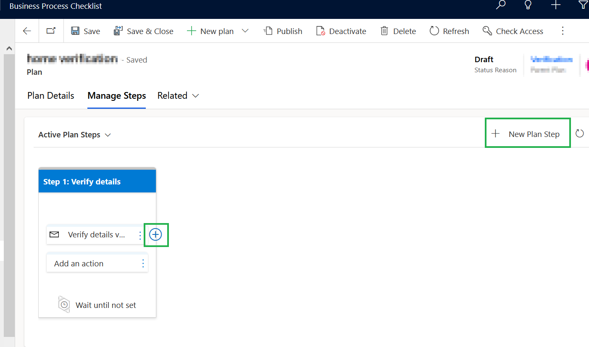

# Plan Step

A Plan (Process) consists of multiple plan steps.

To create **Plan steps**, follow the steps given below:

* Once the plan is created Navigate to **-->** **Manage Steps**.

<figure><figcaption></figcaption></figure>

* Click on the **New Plan Step** button.

<figure><figcaption></figcaption></figure>

* This will open the **‘Quick Create Form: Plan Step’,** where we need to fill in the details**.**
  * **Name:** Give an appropriate name to the Plan Step.
  * **Description:** Give a short description of the Plan Step.
  * **Add a waiting period for this step:**
    * **Days:** Add the desired waiting period for this step to be performed in **Days**.
    * **Hours:** Add the desired waiting period for this step to be performed in **Hours.**

<figure><figcaption></figcaption></figure>

* Once the required fields are filled, click on **‘Save and Close’**.

<figure><figcaption></figcaption></figure>

* Your plan step will be added to the process and will appear here.

<figure><figcaption></figcaption></figure>

* Similarly, we can add more steps, by clicking on the **'New plan step'** or the '**+'** button as shown below.&#x20;

<figure><figcaption></figcaption></figure>
