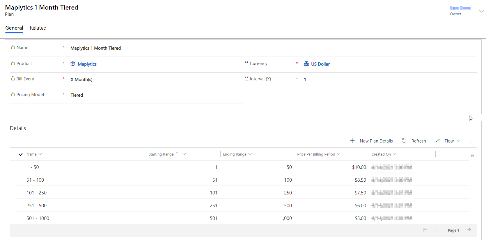
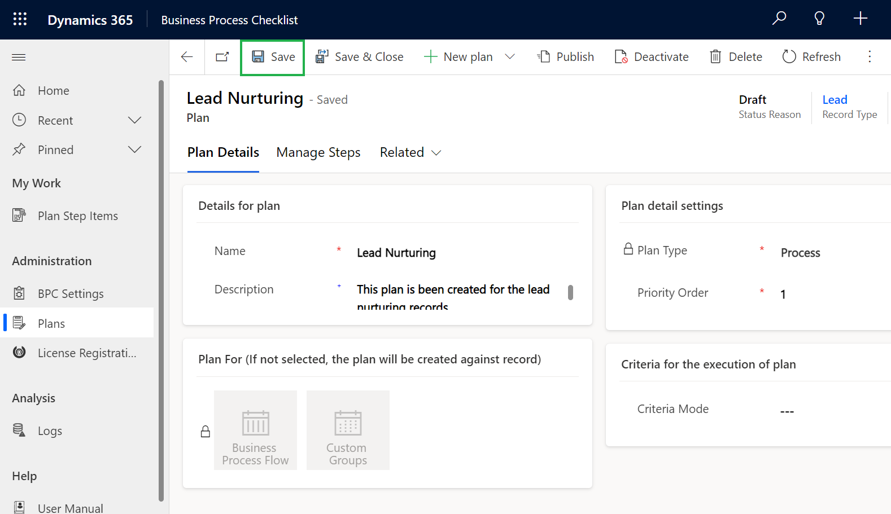
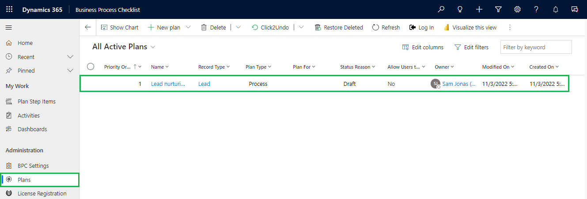

# Plan

Below are the steps to configure the process type plan:

* Navigate to **Business Process Checklist App** **--> Plans --> New Plan.**

<figure><figcaption></figcaption></figure>

* Click on the **New plan** button and select **Process.**

<figure><figcaption></figcaption></figure>

* This will open the **'New Plan'** page where you need to fill in the details.
  * **Name:** Give a unique name to the plan.
  * **Description:** Give a short description of the plan.
  * **Plan Type:** Select Plan Type **** as **Process**.
  * **Priority Order:** Set the execution order against the plan (If the criteria is matching with three different plans, then which plan has to be followed, for that we need to set the priority order number) Any value less than 1 or repeated numbers are invalid for this priority order field. ****&#x20;
* **Record Type:** Select the **Record Type** to which the plan will be attached
* **Set criteria for the execution of Plan:** Set the criteria against the plan (so that if the criteria satisfy then the plan will run against those for which the criteria matches.) Select either **Simple** or **Advanced**.
  * **Simple:** Execute plans based on the View of an entity.
  * **Advanced:** Execute Plans **** based on filter criteria or conditions (conditions defined in Fetch XML).
* **Business Process:** Create a plan for a Business Process Flow.
* **Custom Groups:** Create a plan for a Custom Group.


Note: If both business process or custom groups are not selected then the plan will be created for the record by default.


<figure><figcaption></figcaption></figure>

* Once the required fields are filled, click on **‘Save’**.

<figure><figcaption></figcaption></figure>

* The new plan will be created and can be seen on **Plans**.

<figure><figcaption></figcaption></figure>
