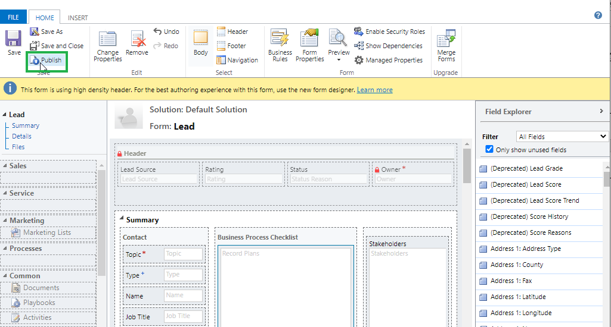
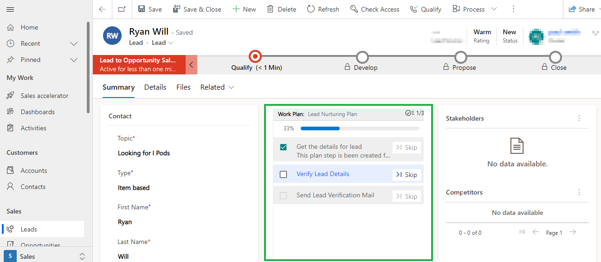
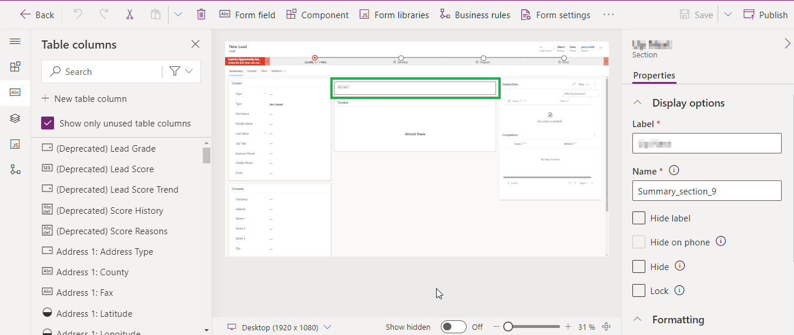
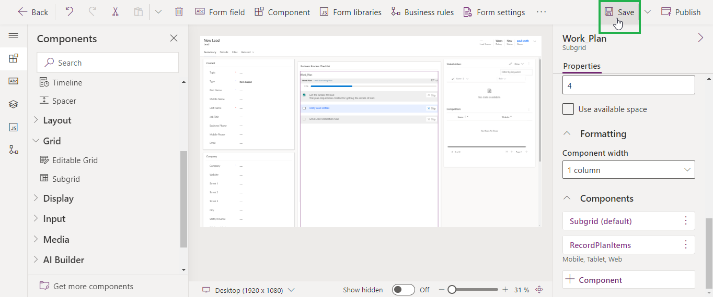
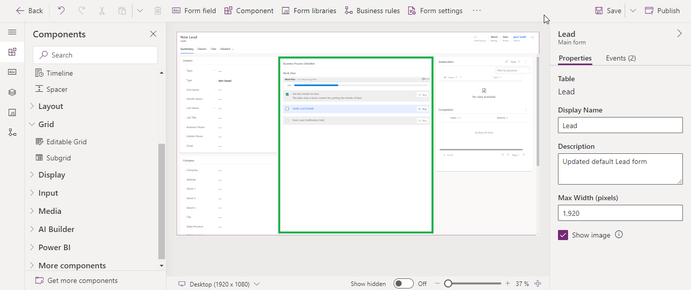

# View Plan Items on Record

For CRM users to follow plans created by managers and complete business processes by following best practices, they can do so by seeing these plans on the records as well. To make plan items appear on associated records, follow the steps given below:

This can be done in the following two ways:

* Using Classic UI
* Using Power Apps UI

### Using Classic UI

* Navigate to **Settings** --> **Customizations.**

<figure><figcaption></figcaption></figure>

* Click on **'Customize the System'.**

<figure><figcaption></figcaption></figure>

* Navigate to **Entities** --> **Lead** --> **Forms**.

<figure><figcaption></figcaption></figure>

<figure><figcaption></figcaption></figure>

* Click on Lead Entity with Form Type Main.

<figure><figcaption></figcaption></figure>

* Select (or Add) the section where you want Plan on Record Form.

<figure><figcaption></figcaption></figure>

* Click on **‘Change Properties’.**

<figure><figcaption></figcaption></figure>

* This will open a **'Section Properties'** form, where you can modify section’s properties.
* Once the required fields are filled, Click **‘OK’**.

<figure><figcaption></figcaption></figure>

* Go to **‘Insert’** Click on **Sub-Grid**.

<figure><figcaption></figcaption></figure>

* This will open a **'Set Properties'** form, where you need to fill in the details.
  * **Records:** Select **‘Only Related Records’.**
  * **Entity:** Select **‘Record Plans (Regarding)’.**
  * **Default View:** Select **‘All Record Plans’.**
* Go to **Controls.**

<figure><figcaption></figcaption></figure>

* Click on **‘Add Control’.**

<figure><figcaption></figcaption></figure>

* Select **‘Record Plan Items’** and click on Add.

<figure><figcaption></figcaption></figure>

* Select the desired options and click on **‘OK’**.

<figure><figcaption></figcaption></figure>

* Click on **‘Save’.**

<figure><figcaption></figcaption></figure>

* Click on **‘Publish’.**

<figure><figcaption></figcaption></figure>

* Now plan will get displayed on the **‘Record Form’.**

<figure><figcaption></figcaption></figure>

### **Using Power Apps UI**

* Go to [https://make.powerapps.com/](https://make.powerapps.com/).

<figure><figcaption></figcaption></figure>

* Select the Environment.

<figure><figcaption></figcaption></figure>

* Navigate to Dataverse **--> Tables**.

<figure><figcaption></figcaption></figure>

* Go to All and search for the required Entity.

<figure><figcaption></figcaption></figure>

* Click on the desired Entity.

<figure><figcaption></figcaption></figure>

* Click on Entity ‘Forms’.

<figure><figcaption></figcaption></figure>

* Click on Lead Entity with Form Type Main.

<figure><figcaption></figcaption></figure>

* Select (or Add) the section where you want Plan on Record Form.

<figure><figcaption></figcaption></figure>

* Go to **‘Properties’.**
  * **Label:** Provide a unique name for the section label.

<figure><figcaption></figcaption></figure>

* Go to **‘Components’.**

<figure><figcaption></figcaption></figure>

* Click on ‘Grid’.

<figure><figcaption></figcaption></figure>

* Click on **‘Subgrid’.**

<figure><figcaption></figcaption></figure>

* This will open **'Select subgrid views'** form, where you need to fill in the details.
  * **Select ‘Show related records.**
  * **Table:** Select **‘Record Plans (Regarding)’.**
  * **Default view:** Select **‘All Record Plans’.**
* Once the required fields are filled, click on **‘Done’.**

<figure><figcaption></figcaption></figure>

* Go to **‘Properties’.**
  * **Label:** Provide a unique label name for the **subgrid.**

<figure><figcaption></figcaption></figure>

* Go to **Components** and click on **‘+ Components’.**

<figure><figcaption></figcaption></figure>

* Select **‘Record Plan Items’.**

<figure><figcaption></figcaption></figure>

* Select the required **"Show component on"** options and click on **‘Done’.**

<figure><figcaption></figcaption></figure>

* Click on **‘Save’.**

<figure><figcaption></figcaption></figure>

* Click on **‘Publish’.**

<figure><figcaption></figcaption></figure>

* Now plan will get displayed on the **‘Record Form’.**

<figure><figcaption></figcaption></figure>


For any queries, reach out to us at [crm@inogic.com](mailto:crm@inogic.com)

