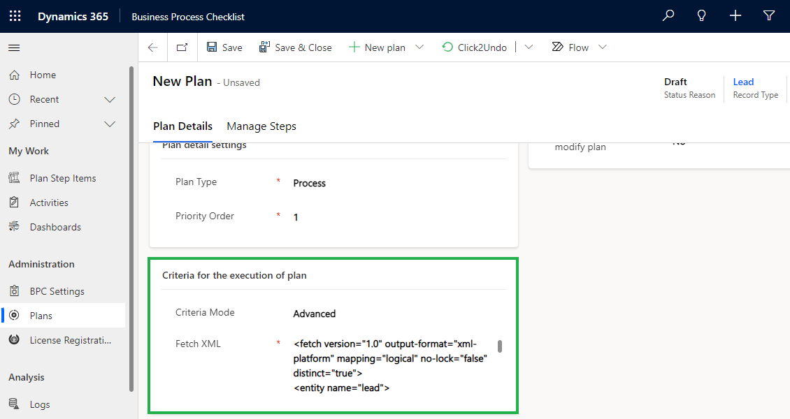

# Business Process Flow Plan

With this feature, you can create both **Process** and **Checklist-type** plans against **Business Process Flow.**

For example, if a user wants to create a plan against the **Lead to Opportunity Business process** to set the best practices for **Lead Nurturing**. **** In order to achieve this, the user has to follow the steps given below:

### Business Process Flow Plan-Process:

* Enable entity configuration for this situation select  **‘Lead’** entity.&#x20;

<figure><figcaption></figcaption></figure>

* Navigate to **BPC Settings** **--> Plans --> New Plan.**

<figure><figcaption></figcaption></figure>

* Click on Create **New plan** button and select **Process.**

<figure><figcaption></figcaption></figure>

* This will open the **'New Plan'** page. Here, you can fill in the details and set the conditions for Plan-Process based on which plan will be executed.

<figure><figcaption></figcaption></figure>

* Fill in the following fields:&#x20;
* **Name:** Give an appropriate name to the plan.
* **Description:** Give a short description of the plan.
* **Plan detail settings:** set the priority order and select the plan type.
  * **Plan Type:** Select Plan Type **** as **Process**.
  * **Priority Order:** Set the execution order against the plan (If the criteria is matching with three different plans, then which plan has to be followed, for that we need to set the priority order number) Any value less than 1 or repeated numbers are invalid for this priority order field. ****&#x20;
* **Record Type:** Select the **Record Type** to which the plan will be attached, here we are selecting the '**Lead' entity**.
* This will set the fields with values as shown below:

<figure><figcaption></figcaption></figure>

* **Set criteria for the execution of Plan:** Set the criteria against the plan (so that if the criteria satisfy then the plan will run against those for which the criteria matches.) Select either **Simple** or **Advanced**.
  * **Simple: Execute plans** based on the View of an entity.
  * **Advanced: Execute Plans** based on filter criteria or conditions (conditions defined in Fetch XML).


Note: This step is same for checklist and process type plans.


<figure><figcaption></figcaption></figure>

#### **1)    Simple Plan** &#x20;

&#x20;**** Simple Plans are plans created based on System Views related to the entity whose Entity Configuration has been selected. **** &#x20;

<figure><figcaption></figcaption></figure>

#### 2) Advance Plan

Plan can be attached based on conditions.&#x20;

For eg. If you want to attach a plan to all the open leads without sequences then you have to enter the Fetch XML for it. Below is the Fetch XML for all the open leads without sequences.

```
<fetch version="1.0" output-format="xml-platform" mapping="logical" no-lock="false" distinct="true">
<entity name="lead">
<attribute name="entityimage_url"/>
<attribute name="fullname"/>
<order attribute="createdon" descending="true"/>
<attribute name="createdon"/>
<attribute name="statuscode"/>
<attribute name="subject"/>
<attribute name="leadid"/>
<attribute name="companyname"/>
<filter type="and">
<condition attribute="ownerid" operator="eq-userid"/>
<condition attribute="statecode" operator="eq" value="0"/>
</filter>
<link-entity name="connection" from="record1id" to="leadid" link-type="outer" alias="connection">
<attribute name="record1id"/>
</link-entity>
<link-entity name="msdyn_sequencetarget" from="msdyn_target" to="leadid" alias="sequencetarget" link-type="inner">
<filter type="and">
<condition attribute="msdyn_sequencetargetid" operator="null"/>
</filter>
</link-entity>
<filter type="and">
<condition attribute="record1id" operator="null" entityname="connection"/>
</filter>
</entity>
</fetch>
```

In the same way, you can create Advanced plans for other records also.

<figure><figcaption></figcaption></figure>

* Select **'Business Process'.**

<figure><figcaption></figcaption></figure>

* Select Business Process Flow to which the plan will be attached.

<figure><figcaption></figcaption></figure>

* Once the required fields are filled, click on **‘Save’**.

<figure><figcaption></figcaption></figure>

* Click on **'New Plan'.**

<figure><figcaption></figcaption></figure>

* Fill in the Plan Details and Click **'Save'**:
  * **Name:** Give an appropriate name to the plan.
  * **Description:** Give a short description of the plan.

<figure><figcaption></figcaption></figure>

* To know how to create Plan Steps please [click here](https://docs.inogic.com/business-process-checklist/configuration/configuration-for-plans-process/plan-step).
* To know how to create Plan Step Actions [click here](https://docs.inogic.com/business-process-checklist/configuration/configuration-for-plans-process/plan-step-action).

### Business Process Flow Plan-Checklist:

* Enable entity configuration for this situation select the **‘Lead’** entity.&#x20;

<figure><figcaption></figcaption></figure>

* Navigate to **BPC Settings** **--> Plans --> New Plan.**

<figure><figcaption></figcaption></figure>

* Click on Create **New plan** button and select **Checklist.**

<figure><figcaption></figcaption></figure>

* This will open the **'New Plan'** page. Here, you can fill in the details and set the conditions for Plan-Checklist based on which plan will be executed.

<figure><figcaption></figcaption></figure>

* Fill in the following fields:&#x20;
* **Name:** Give an appropriate name to the plan.
* **Description:** Give a short description of the plan.
* **Plan detail settings:** set the priority order and select the plan type.
  * **Plan Type:** Select Plan Type **** as **Checklist**.
  * **Priority Order:** Set the execution order against the plan (If the criteria is matching with three different plans, then which plan has to be followed, for that we need to set the priority order number) Any value less than 1 or repeated numbers are invalid for this priority order field. ****&#x20;
* **Record Type:** Select the **Record Type** to which the plan will be attached, here we are selecting the '**Lead' entity**.
* This will set the fields with values as shown below:

<figure><figcaption></figcaption></figure>

**Set criteria for the execution of Plan:** Set the criteria against the plan (so that if the criteria satisfy then the plan will run against those for which the criteria matches.) Select either **Simple** or **Advanced**.

* **Simple: Execute plans** based on the View of an entity.
* **Advanced: Execute Plans** based on filter criteria or conditions (conditions defined in Fetch XML).

<figure><figcaption></figcaption></figure>

* Select **'Business Process'.**

<figure><figcaption></figcaption></figure>

* Select Business Process Flow to which the plan will be attached.

<figure><figcaption></figcaption></figure>

* Once the required fields are filled, click on **‘Save’**.

<figure><figcaption></figcaption></figure>

* Click on **'New Plan'.**

<figure><figcaption></figcaption></figure>

* Fill in the Plan Details and Click **'Save'**:
  * **Name:** Give an appropriate name to the plan.
  * **Description:** Give a short description of the plan.

<figure><figcaption></figcaption></figure>

* To know how to create Plan Steps please[ click here](https://docs.inogic.com/business-process-checklist/configuration/configuration-for-plans-checklist/plan-step).
