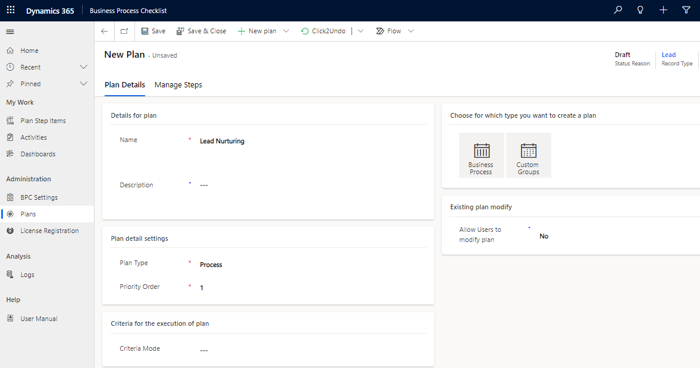
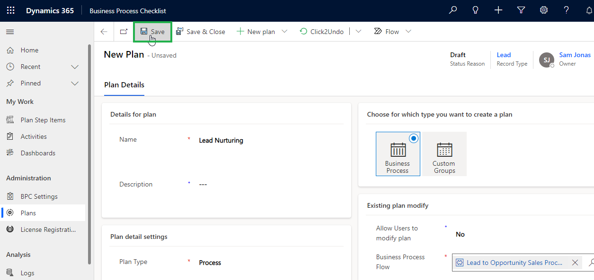
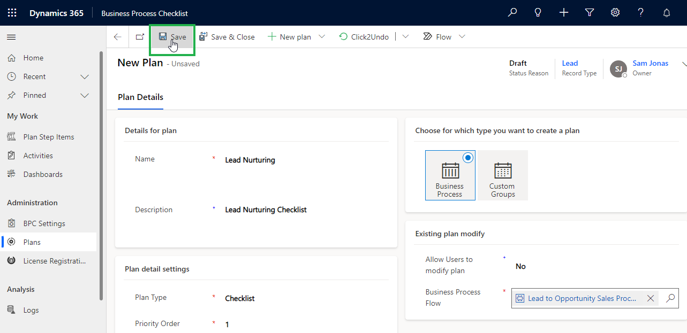
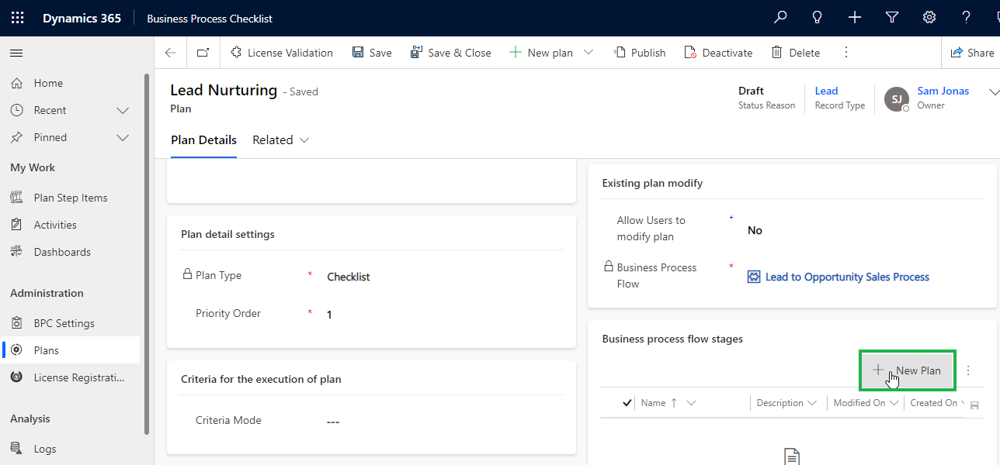

# Business Process Flow

With this feature, you can create both **Process** and **Checklist-type** plans against **Business Process Flow.**

For example, if a user wants to create a plan against the **Lead to Opportunity Sales process** to set the best practices for **Lead Nurturing**. **** In order to achieve this, the user has to follow the steps given below:

### Business Process Flow - Process:

* **Fill in the following details:** Name, Description, Plan Type, Priority Order, Record Type.

<figure><figcaption></figcaption></figure>

* **Set criteria for the execution of the Plan:** Set the criteria against the plan (so that if the criteria satisfy then the plan will run against those for which the criteria matches.) Select either **Simple** or **Advanced**.
  * **Simple:** Execute plans based on the View of an entity.
  * **Advanced:** Execute Plans **** based on filter criteria or conditions (conditions defined in Fetch XML).


Note: This step is the same for checklist and process-type plans.


<figure><figcaption></figcaption></figure>

#### **1)    Simple**&#x20;

Simple criteria can be set on System Views of the Record Type.

<figure><figcaption></figcaption></figure>

#### 2) Advance&#x20;

Plans can be attached based on conditions.&#x20;

For eg. If you want to attach a plan to open leads with lead source as web then you have to enter the Fetch XML for it. Below is the Fetch XML for the open lead where the lead source is the web.

<pre><code>&#x3C;fetch version="1.0" output-format="xml-platform" mapping="logical" no-lock="false" distinct="true">
&#x3C;entity name="lead">
&#x3C;attribute name="entityimage_url"/>
&#x3C;attribute name="fullname"/>
&#x3C;order attribute="fullname" descending="false"/>
&#x3C;attribute name="statuscode"/>
&#x3C;attribute name="createdon"/>
&#x3C;attribute name="subject"/>
<strong>&#x3C;attribute name="leadid"/>
</strong>&#x3C;filter type="and">
&#x3C;condition attribute="statecode" operator="eq" value="0"/>
&#x3C;condition attribute="leadsourcecode" operator="eq" value="8"/>
&#x3C;/filter>
&#x3C;/entity>
&#x3C;/fetch></code></pre>

In the same way, you can set Advance criteria for other plan records as well.

<figure><figcaption></figcaption></figure>

* Select **'Business Process'.**

<figure><figcaption></figcaption></figure>

* Select Business Process Flow to which the plan will be attached.

<figure><figcaption></figcaption></figure>

* Once the required fields are filled, click on **‘Save’**.

<figure><figcaption></figcaption></figure>

* Click on **'New Plan'.**

<figure><figcaption></figcaption></figure>

* Fill in the Plan Details and Click **'Save'**:

<figure><figcaption></figcaption></figure>

* add how to create a plan step for bpf here.&#x20;
* To create Plan Step Actions [click here](https://docs.inogic.com/business-process-checklist/configuration/configuration-for-plans-process/plan-step-action).

### Business Process Flow - Checklist:

* **Fill in the following details:** Name, Description, Plan Type, Priority Order, Record Type.

<figure><figcaption></figcaption></figure>

**Set criteria for the execution of plan:** Set the criteria against the plan (so that if the criteria satisfy then the plan will run against those for which the criteria match). Select either **Simple** or **Advanced**.

* **Simple:** Execute plans based on the View of an entity.
* **Advanced:** Execute Plans based on filter criteria or conditions (conditions defined in Fetch XML).

<figure><figcaption></figcaption></figure>

* Select **'Business Process'.**

<figure><figcaption></figcaption></figure>

* Select Business Process Flow to which the plan will be attached.

<figure><figcaption></figcaption></figure>

* Once the required fields are filled, click on **‘Save’**.

<figure><figcaption></figcaption></figure>

* Click on **'New Plan'.**

<figure><figcaption></figcaption></figure>

* Fill in the Plan Details and Click **'Save'**:

<figure><figcaption></figcaption></figure>

* Add how to create a plan step for BPF here.
