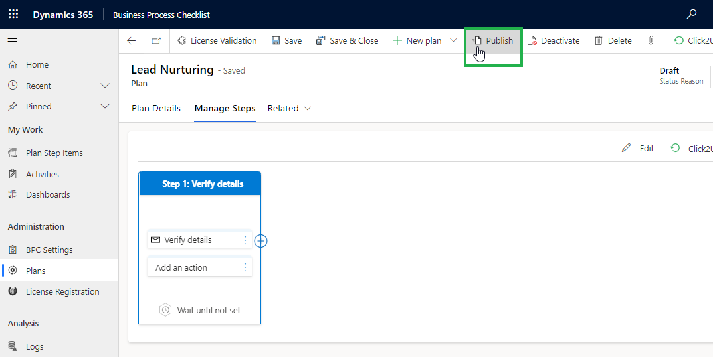

# Revise Plan

Plans can be revised to suit the circumstances of the business process. In Business Process Checklist, you can easily modify existing Plans, Plans Step, and Plan Step Actions as and when required.&#x20;

To revise existing published Plans, Plan Steps, and Plan Step Actions for both process and checklist-type plans, follow the steps given below:

## Revise Plans - Process:

### 1) Plans

* To revise existing published plans navigate to **Business Process Checklist App --> Plans --> Open existing published plan**.

<figure><figcaption></figcaption></figure>

* Click on the **'Revise'** Button, this will change the plan status to **Draft**.

<figure><figcaption></figcaption></figure>

* Make the required changes to the plan --> Click on the **‘Save’** button.

<figure><figcaption></figcaption></figure>

### 2) Plan steps

* To Edit Plan Step navigate to **Manage Steps** --> Click on the **ellipses** --> Click on **'Edit'**.

<figure><figcaption></figcaption></figure>

* Make the required changes to the plan step --> Click on the **‘Save’** Button.

<figure><figcaption></figcaption></figure>

### 3) Plan Step Action

* To Edit Plan Step Action navigate to **--> Manage Steps -->** Click on the **ellipses -->** Click on **'Edit'**.

<figure><figcaption></figcaption></figure>

* Make the required changes to the Plan Step Action **-->** Click on the **‘Save’** Button.


Note: Locked Fields can't be edited.


<figure><figcaption></figcaption></figure>

* Click on **'Publish'.**

<figure><figcaption></figcaption></figure>

### Revise Plans-Checklist:

### 1) Plan

* To revise existing published plans navigate to **Business Process Checklist App --> Plans --> Open existing published plan**.

<figure><figcaption></figcaption></figure>

* Click on the **'Revise'** Button, this will change the plan status to **Draft**.

<figure><figcaption></figcaption></figure>

* Make the required changes to the plan **-->** Click on the **‘Save’** button.

<figure><figcaption></figcaption></figure>

### 2) Plan Step

* To Edit Plan Step navigate to **--> Manage Steps --> Select** the **Existing Plan Step** you want to edit **-->** Click on the **'Edit' Button**.

<figure><figcaption></figcaption></figure>

* Make the required changes to the plan step --> Click on **‘Save’**.

<figure><figcaption></figcaption></figure>

* Click on **'Publish'.**

<figure><figcaption></figcaption></figure>
