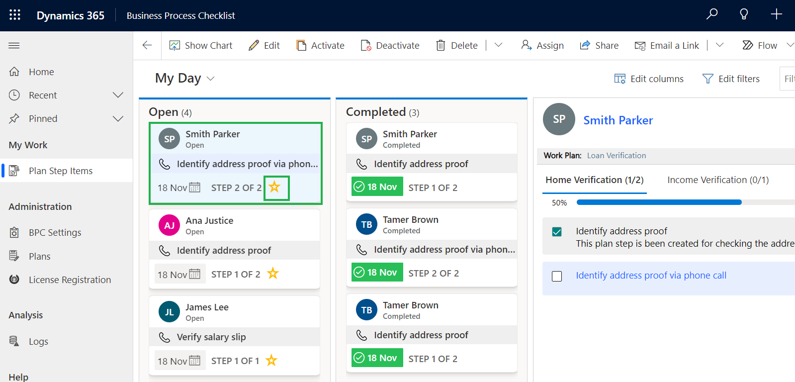

# Auto-Attach the Plan to Record

Plans defined by the manager will automatically get attached to the records as per the matched criteria. And whenever a new record will be created in the chosen record type the set plan for it will automatically get connected to the newly created record.

**Below is an example:**

* Suppose the manager has created a plan for lead nurturing for the lead entity, where the criteria are set as lead source as **"Web".**

<figure><figcaption></figcaption></figure>

* Navigate to **Sales Hub -->** Go to **Leads -->** Create a **New Lead** with source as **Web.**

<figure><figcaption></figcaption></figure>

* So, whenever the lead is created with the lead source as **“Web”** then the lead nurturing plan will get attached to that lead record.

<figure><figcaption></figcaption></figure>

**Miscellaneous Features:**&#x20;

* The action can be completed by clicking on the **Checkbox.**

<figure><figcaption></figcaption></figure>

* Users can be able to skip the **plan step** instead of performing it.

<figure><figcaption></figcaption></figure>

* The user can check the progress and number of completed steps count.

<figure><figcaption></figcaption></figure>

* Users can mark **plan steps** as favorites by clicking on the icon shown below. Once marked as favorites, users can see them in the Important Items View.

<figure><figcaption></figcaption></figure>


Note: In the same way, you can unmark to remove favorite plan steps from the Important Items view.


* Users can view the due date against each **open-plan step.** The due date can be changed as per the requirements. due date is the date on which the plan step is set to be performed.

<figure><figcaption></figcaption></figure>


For any queries, reach out to us at [crm@inogic.com](mailto:crm@inogic.com)

