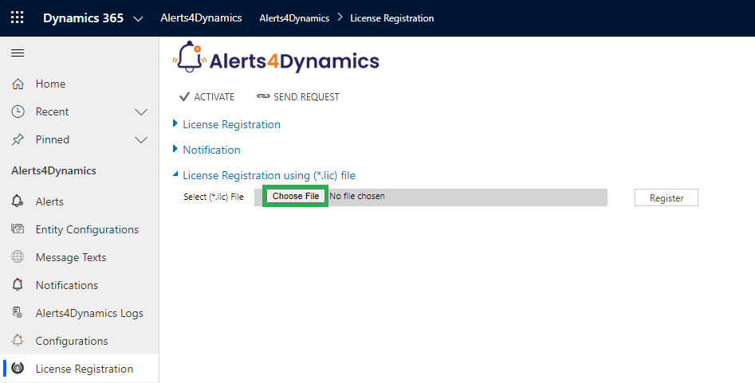

# Handling Failures

Business process checklist gives users provision to seamlessly resume handling plans and plans steps after resolving Errors/Failures.

Here are examples for Error/Failure handling in the event of license expiry:

**Example 1:**&#x20;

Plan is getting attached to a newly created lead, post license expiry. Follow the steps given below to handle failures in this scenario.

* Error/Failure: Plan gets attached to the new record (Lead), where steps are not been created to be followed by the salesperson.
* First, resolve the issue causing the Error/Failure.  Here we will extend the license period.
* Once you resolve the issue causing the Error/Failure you will see a retry button on the plan attached to the newly created record (Lead).
* Click on the ‘Retry’ Button.
* Once you click on the retry button, you will now be able to see the plan steps on plans.

**Example 2:**&#x20;

License expires while an existing plan on the lead is being executed. Follow the steps given below to handle failures in this scenario.

* Error/Failure: Users are unable to perform pending plan steps on existing plans.
* First, resolve the issue causing the Error/Failure. Here we will extend the license period.
* Once you resolve the issue causing the Error/Failure you will see retry button on the pending plan steps.
* Click on the ‘Retry’ Button.

<figure><figcaption></figcaption></figure>

* After clicking the "Retry" button, you will be able to complete any pending plan steps.

<figure><figcaption></figcaption></figure>


For any queries, reach out to us at [crm@inogic.com](mailto:crm@inogic.com)

