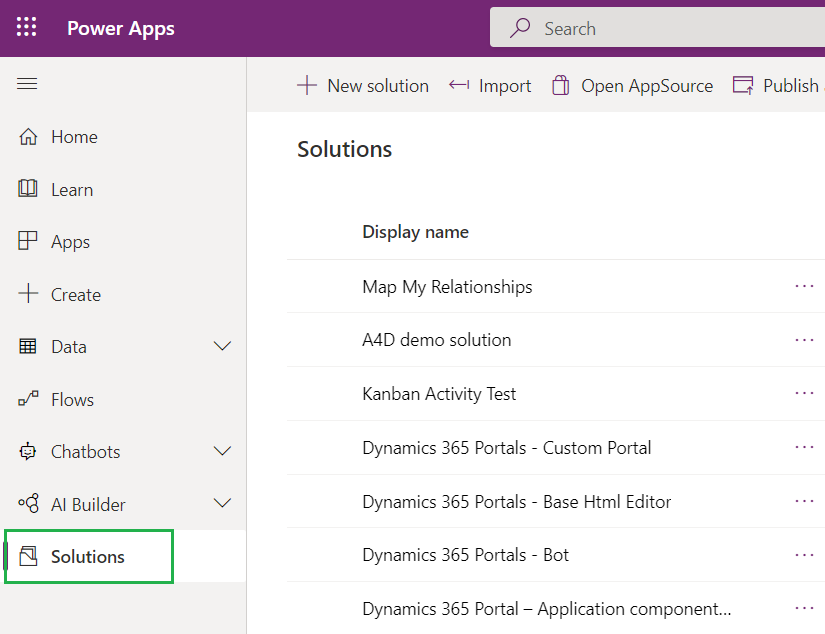
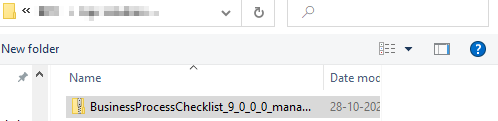
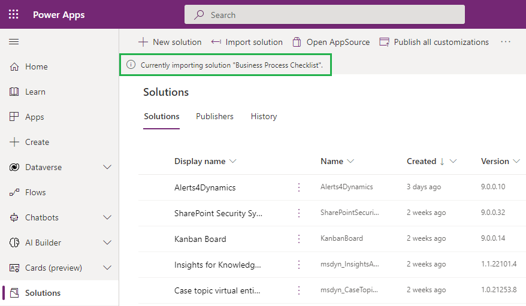
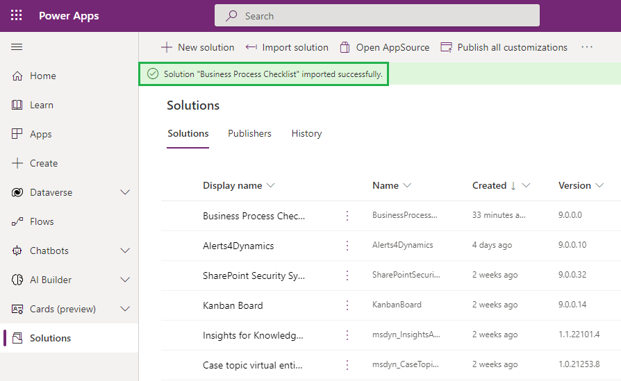

# Install from Website

Installing Business Process Checklist solution in your CRM or Dataverse environment is quite easy. Download it from the [Website](https://www.inogic.com/product/productivity-apps/business-process-dynamics-365-crm-to-do-checklist-sequence), installation can be done in following two ways:

### Using Power Apps UI&#x20;

To import a solution, first sign into [Power Apps](https://make.powerapps.com/?utm\_source=padocs\&utm\_medium=linkinadoc\&utm\_campaign=referralsfromdoc).

* Once you have signed in, select the instance on which you want to install the solution.

<figure><figcaption></figcaption></figure>

* Then select **Solutions** from the left navigation as shown in below screenshot:

<figure><figcaption></figcaption></figure>

* On the command bar, select **Import**.

<figure><figcaption></figcaption></figure>

* On the **Import a solution** page, select **Browse** to locate the compressed (.zip) file that contains the solution you want to import.

<figure><figcaption></figcaption></figure>

<figure><figcaption></figcaption></figure>

* &#x20;Select **Next.**

<figure><figcaption></figcaption></figure>

* Select **Import** and proceed to import the solution.

<figure><figcaption></figcaption></figure>

* Your solution will get imported. To check the status of the installation, refresh the page.

<figure><figcaption></figcaption></figure>

* After the solution is imported you will get a message on the top notifying the same.

<figure><figcaption></figcaption></figure>

### Using Classic UI

* To import the solution, navigate to **Advanced Settings** on Gear Icon on the top right.

<figure><figcaption></figcaption></figure>

* Navigate to **Settings -> Solutions.**

<figure><figcaption></figcaption></figure>

* Click on **Import.**

<figure><figcaption></figcaption></figure>

* **Browse** the downloaded file and click open.

<figure><figcaption></figcaption></figure>

* Click on **‘Next’.**

<figure><figcaption></figcaption></figure>

* Next, check **‘Enable any SDK message processing steps included in the solution’** and proceed to import the solution.

<figure><figcaption></figcaption></figure>

* Solution is successfully imported

<figure><figcaption></figcaption></figure>
