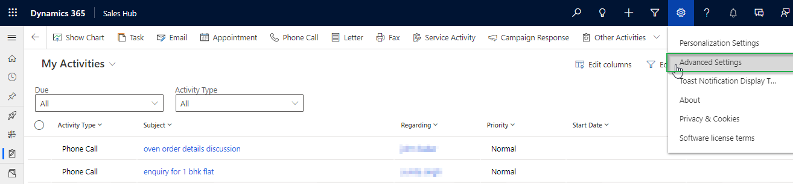
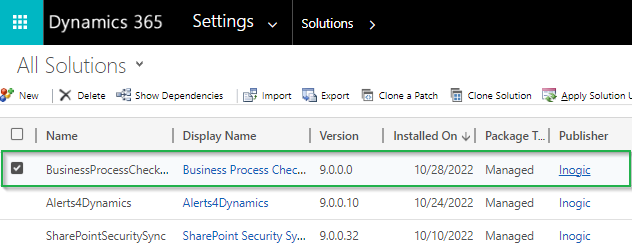
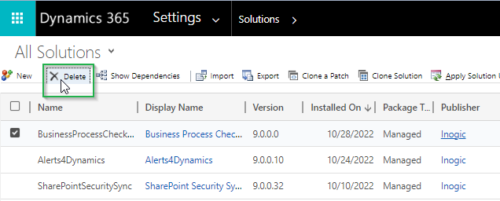

# Uninstallation

Like installing the Business Process Checklist solution, uninstalling the solution from your CRM and Power Apps environment is quite simple. But first, you will have to remove the dependencies. Just follow the steps given below for the same:

* Navigate to **Business Process Checklist App** --> **BPC Settings.**

<figure><figcaption></figcaption></figure>

* To delete all entity configurations click on **Delete** icons.

<figure><figcaption></figcaption></figure>

* Click on **Delete.**

<figure><figcaption></figcaption></figure>

* &#x20;Ensure all enabled **Entity Configurations** are deleted.

<figure><figcaption></figcaption></figure>

* Go to **Plans.**

<figure><figcaption></figcaption></figure>

* Select all **Plans**.

<figure><figcaption></figcaption></figure>

* Click on **Delete** Button.

<figure><figcaption></figcaption></figure>

* Click on **Delete.**

<figure><figcaption></figcaption></figure>

Once the dependencies are removed you can uninstall the solution from the **Dynamics 365 CRM** and **Power Apps** environment. **** To uninstall the solution, follow the simple steps given below:

### Uninstall from Classic UI

* After deleting the plans and entity configuration, click on the **Gear Icon** in the top right corner and go to **Advanced Settings**.

<figure><figcaption></figcaption></figure>

* Go to **Settings** --> **Solution** --> Select **Business Process Checklist** solution.

<figure><figcaption></figcaption></figure>

* Click on the delete button --> Click on the **OK** button. Now, in a short time, the solution will be uninstalled from your environment.

<figure><figcaption></figcaption></figure>

<figure><figcaption></figcaption></figure>

### Uninstall from Power Apps

After deleting the plans and entity configuration,  navigate to [make.powerapps.com](https://make.powerapps.com/)****

* In Solutions, select the Business Process Checklist Solution **→** Click on **Delete.**

<figure><figcaption></figcaption></figure>

* A pop-up will appear asking for your confirmation **→** Click on Delete and the solution will be uninstalled from your environment.

<figure><figcaption></figcaption></figure>
