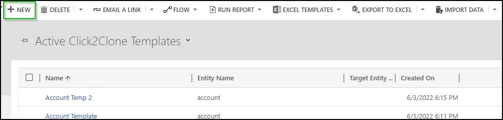
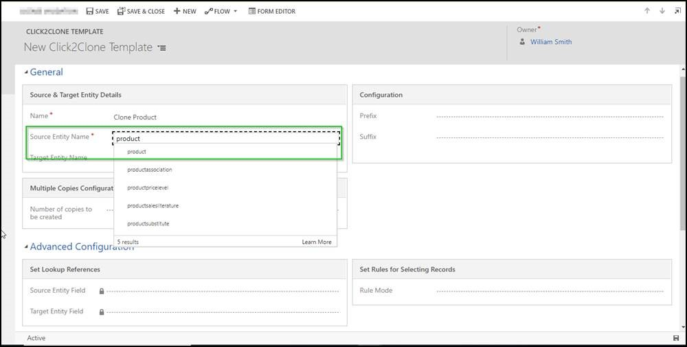

# FAQs

## 1) How to migrate Click2Clone template(s) from one environment to the other?

Please refer this [link.](https://docs.inogic.com/click2clone/how-to-guides/export-import-click2clone-template)

## 2) We have done a sandbox copy of the production environment to a TEST environment and would like to work with 'Click2Clone' solution in this new instance. What should we do?

For this, you need to delete the **Inogic License Details** record from your sandbox environment. After deleting, the next step would be to [activate the license](https://docs.inogic.com/click2clone/getting-started/activate-license).

To delete the **Click2Clone** license follow the steps given below:

* Navigate to **Advanced Find.**

.jpg>)

* Select **Inogic License Details** in **‘Look for’** --> Click on **Results** button.

.jpg>)

* Select the **Click2Clone** record and **delete** it.

## 3) Does Click2Clone support cloning for custom entities?

Yes, it clones the custom entities as well.

## 4) How does Click2Clone work with security roles?

Please refer this [link](https://docs.inogic.com/click2clone/getting-started/set-security).

## 5) Does Click2Clone copy the child records?

Yes, it clones the **related/associated** records. Please refer this[ link.](https://docs.inogic.com/click2clone/configuration/cloning-a-record)

## 6) Does Click2Clone also support N-level cloning, for e.g. Quote -> Quote Line -> Custom entity?

Yes, it supports the deep cloning, so if the user wants to clone a quote having quote line that further has some custom entity with 1: N relationship, then Click2Clone allows to copy this entire structure. Please refer this [link.](https://docs.inogic.com/click2clone/configuration/cloning-a-record)

## 7) Does Click2Clone support cloning from one entity to the other?&#x20;

Yes, Click2Clone allows user to clone from one entity to the other entity including custom entities. Please refer this [link.](https://docs.inogic.com/click2clone/configuration/copying-from-one-record-to-another)

## 8) Who would be able to do any modifications to the Click2Clone template?

A user with a **System Admin/Click2Clone administrator** role will be able to edit the Click2Clone template.

## 9) Does Click2Clone provide any provision that helps user to quickly recognize a cloned record?

Yes, Click2Clone gives user a provision to add a **prefix/suffix** to the record name. Refer this [link.](https://docs.inogic.com/click2clone/configuration/cloning-a-record/click2clone-template)

## 10) Can I create multiple clone copies in one go?

Yes, Click2Clone has made it a lot easier to create multiple clone copies of the record in just one click. Refer this [link.](https://docs.inogic.com/click2clone/features/multiple-copies-of-a-record)

## 11) Does Click2Clone support cloning based on a specific event that occurs in CRM? ( Field change, Status change, etc.)

Yes, Click2Clone clones the record when there is any specific event that occurs in CRM. Refer this [link](https://docs.inogic.com/click2clone/configuration/automation/run-workflow-automatically).

## 12) What if user cannot see the 'Click2Clone' button on the entity?&#x20;

User needs to create a template for the selected entity in order to make **'Click2Clone'** button show up on the selected entity record and also make sure that the user has Click2Clone privileges.

## 13) What to do if related record is not getting cloned?

User needs to make sure to select the appropriate relevant relationship from the relationship grid to clone the respective related record. Kindly refer this [link.](https://docs.inogic.com/click2clone/configuration/cloning-a-record)

## 14) What is the reason for prefix/suffix not getting added to the cloned record despite defining it in template configuration?

If there is any plugin, scripting or business rule in CRM which is used to modify the primary attribute field of the record then prefix/suffix would not be added to the primary attribute.

## 15) Is it possible to automate the cloning process?

Yes, user can certainly automate the clone run for efficiency. Refer the [link.](https://docs.inogic.com/click2clone/configuration/automation)

## 16) What to do if you get "Sorry, we couldn't find a Dynamics 365 organization connected to the signed-in user." message while installing from AppSource?

.jpg>)

**If you get the above message then follow the steps given below:**

* In the page URL, change CRM region to your specific region i.e. suppose your CRM URL is **'mycrm.crm8.dynamics.com'.**

.jpg>)

* Then, you would just need to change the Page URL to [https://port.crm8.dynamics.com/g/marketplace](https://port.crm8.dynamics.com/g/marketplace)...

.jpg>)

After following the above steps, you will be able to successfully **install** Click2Clone solution from AppSource.

## 17) After importing the solution of Click2Clone from website all the Processes of Click2Clone is in a 'Draft/Deactivated' state. What to do?

Once the solution is imported, please follow the below steps to activate all the processes of Click2Clone.

* Click on the **gear icon** --> Select **Advanced Settings**.&#x20;

* Next, select **Processes**.

* From **'All Process'** View activate the process shown in the below screenshot:

## **18) What if a user cannot see the entities in ‘Source Entity Name/Target Entity Name' while creating Click2Clone template?**

In UCI, the Source Entity Name/Target Entity Name field for the Click2Clone template lists out only the entities with ownership as ‘**User** **or** **Team’.**

The entities with ownership at the **Organization** level will not get listed out in the Source Entity Name/Target Entity Name field for Click2Clone template.

Hence to create a Click2Clone Template record for such entities/tables, we need to create them from the classic UI where these do get listed out. &#x20;

Kindly follow the below steps to create a template for the product entity/table from the classic UI:

* Navigate to **Settings** -> **Advanced Settings**.

<figure><figcaption></figcaption></figure>

* Select **Settings** dropdown. Click on next page icon.

<figure><figcaption></figcaption></figure>

* Click on **Click2Clone Template**.

<figure><figcaption></figcaption></figure>

* Click on **New** button from Ribbon bar.

<figure><figcaption></figcaption></figure>

* Enter Template Name.  In **Source** **Entity** **Name**, kindly search the entity with its logical name. For example, lets search **Product** with its logical name i.e. ‘**product’**.

<figure><figcaption></figcaption></figure>
