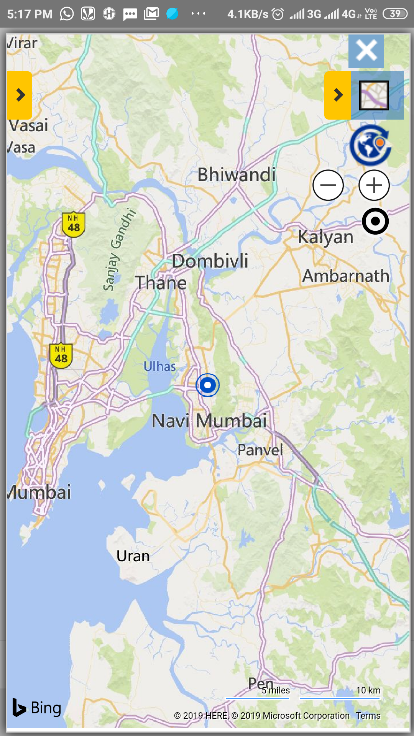

# Activate License

The first and foremost step after installing solution is License Activation.

Here are the steps to activate **Click2Clone** license.

* Navigate to **Dynamics 365** --> **Click2Clone** app.&#x20;

* Go to **License Registration**.

.png>)

Enter the Details: First Name, Last Name, Company Name, Email, Website and Main Phone --> Click on **ACTIVATE**.

.png>)

If you want to purchase or extend the trial, click on **SEND REQUEST** --> Enter all details --> Click again on **SEND REQUEST** and send the email to Inogic.

.png>)

### Alternate method to complete License Activation __&#x20;

Here are the steps to complete registration through the **‘License Registration using (.lic) file’** section.

* Request .lic file from Inogic --> Save file --> Go to **Click2Clone** app --> **License Registration** --> Click **Choose File** to locate the file with the extension .lic

.png>)

* Select the file --> Click **Open**.

* Click on **Register** to complete the **License Registration**.

.png>)
