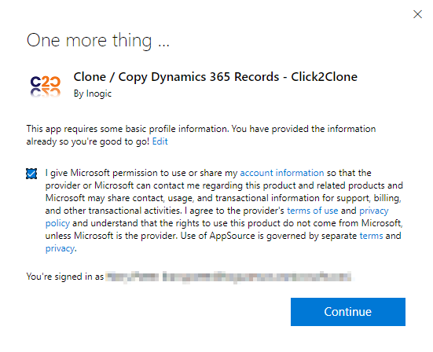
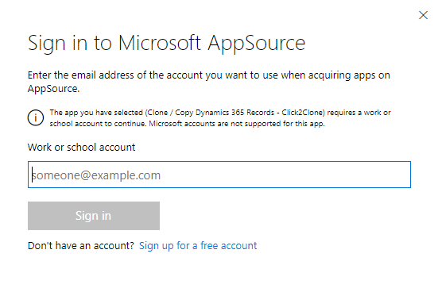
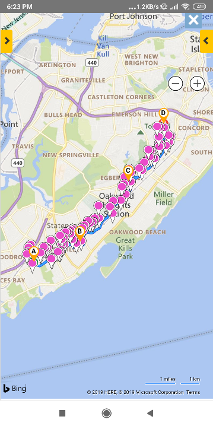

# Install from Microsoft AppSource

To install **Click2Clone** solution from the **Microsoft AppSource**, visit the [link](https://appsource.microsoft.com/en-us/product/dynamics-365/inogic.d59d49e1-e228-4243-8155-9b937290bcf5) and follow the steps shown below.&#x20;

* Click on the **FREE TRIAL** button.

.png>)

* If the user is already logged into CRM, accept the terms & conditions and click on **Continue**.

* If the user is not logged into CRM, fill in the credentials and **Sign in**.

* Next, confirm the details in the form, accept the terms & conditions and click on **Continue**.

.png>)

* &#x20;Select an environment from the dropdown list. Click on the checkboxes to accept the legal terms and privacy policies. Then proceed further by clicking on the **Install** button.

.png>)

* The installation process will now have started and you can check the status by refreshing the page.

.png>)

* After the installation is done, you will be able to see **Click2Clone** solution in **My apps**.&#x20;

