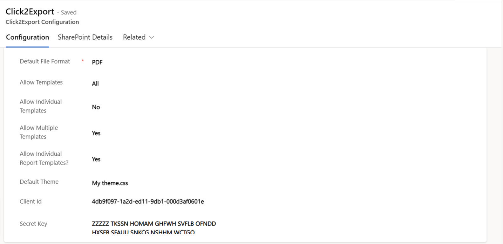
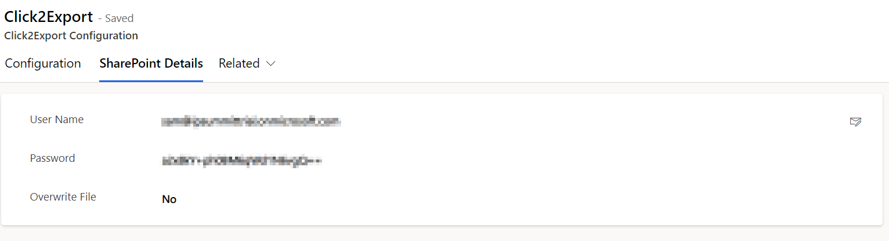

# Click2Export Configuration

**Click2Export Configuration** is where you define the **global settings** for Click2Export. It is automatically created when you activate the license.

Let's have a look at the different fields in **'Click2Export Configuration'** and what they stand for.

### Configuration:&#x20;

<figure><figcaption></figcaption></figure>

**Default File Format:** It allows users to select the **Default File Format** that will be applied on CRM Report Template at the time of creation. **** PDF, Excel, Word, CSV and TIFF are the options available. By default, with the solution it is set as **PDF**.

**Allow Templates:** Based on the selection, it will either allow the creation of CRM Report Templates for Word Template, Excel Template or Email Template or else, it will restrict the creation to the selected template. This setting affects Word Template, Excel Template and Email Template. If the user selects excel then it is necessary to [**set credentials**](https://docs.inogic.com/click2export/prerequisites/set-credentials) and **generate token**. Otherwise, the Excel template will not work.

**Allow Individual Templates:** Based on your selection, it will either allow or restrict the creation of CRM Report Template for Personal Word Template or Personal Excel Template. This setting affects only Word Template and Excel Template.

**Allow Multiple Templates:** If set to **Yes**, then it will allow users to create multiple CRM Report Templates for a Report. This setting affects SSRS Report Templates.

**Allow Individual Report Templates?:** If set to **Yes**, then it will allow users to create CRM Report Template for such **Reports** which are **Viewable By** an Individual or else it will restrict the creation of CRM Report Template for such Reports. This setting affects SSRS Report Templates. By default, it is set as **NO.**

**Default Theme:** The CSS file you’ve uploaded to be used as default theme while exporting CRM views data.&#x20;

**Client Id:** Client ID you’ve generated while creating Azure App [here](https://docs.inogic.com/click2export/prerequisites/set-credentials).&#x20;

**Secret Key:** Secret Key you’ve generated while creating Azure App [here.](https://docs.inogic.com/click2export/prerequisites/set-credentials)


**Note: Once a CRM Report Template is created, it is accessible to all users in the organization and anybody can export that report. So set these values accordingly.**


### SharePoint Details:

If you wish to leverage Click2Export’s '**Upload to SharePoint'** functionality, then you need to provide your credentials in this section. Before configuring the SharePoint Details, please go through the [prerequisite ](https://docs.inogic.com/click2export/prerequisites)for Upload to SharePoint functionality.

<figure><figcaption></figcaption></figure>

**User Name:** User ID of the user under the context of whom the files will be uploaded to SharePoint.

**Password:** Password for the provided User ID.

**Overwrite File:** If set to Yes, then it will overwrite files with the same name in SharePoint. For most of the cases it is recommended to set it to No.


**Note: For on-premises, below configuration is necessary** **to export SSRS report using Click2Export.**&#x20;


**Reporting Server:** http://\<domain-name>/ReportServer/ReportExecution2005.asmx&#x20;

**Report Path**: \<environmentname>\_MSCRM/CustomReports


For further queries, reach out to us at [crm@inogic.com](mailto:crm@inogic.com)


