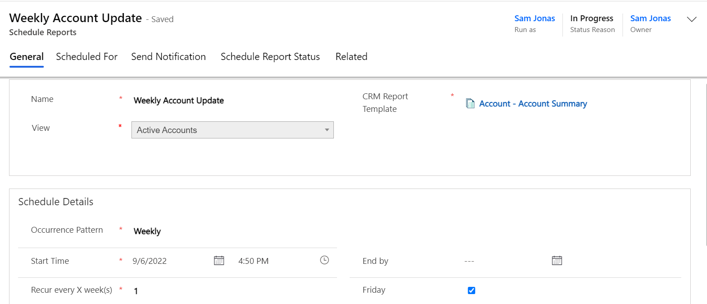
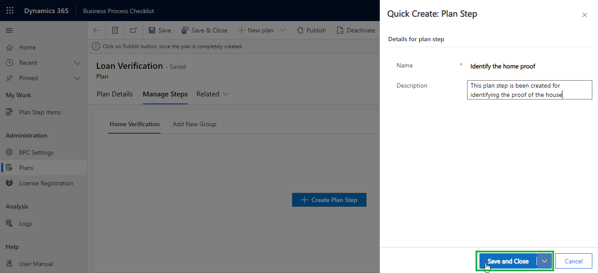

# Schedule Reports

With this feature you can **set schedule** to export and auto send **Reports/Word/Excel/Email Templates (CRM Views)** as email attachments at **regular intervals**.

* Navigate to **Click2Export --> Schedule Reports --> New** and fill the relevant details as shown below:

### General:

<figure><figcaption></figcaption></figure>

In General details the following fields need to be defined.

**Name:** Give name for the record (Schedule Reports).

**CRM Report Template:** Select the required **CRM Report Template** from the lookup field – **SSRS/Excel/Word/Email.**

**View:** Select the necessary view from the drop-down. Export and mail selected Word Template against each individual record present in the selected view. In case of Excel Template, the mail will be sent only to particular recipients selected while configuring CRM Report Template. _**(This field appears only if Word/Excel Template is selected for CRM Report Template).**_

Under **Schedule Details** the user has to fill the following requirements.

**Occurrence Pattern:** Select any one option from **Daily, Weekly and Monthly.**

**Start Time:** Select the starting date and time to trigger the first export. Date and time should be current. Past date and time is not considered.

**End by:** Select the end date and time till when the report should be exported on a regular basis.

### **Interval:**&#x20;

The interval period depends upon the occurrence pattern selected by the user.

&#x20;     a) In the below screenshot, **Occurrence Pattern** is set as **Daily** and **Every X day(s)** is set as **3**. Here the first process will occur on 6th June 2019, at 5:30 and from there onwards every **3rd day** till the **End by** date & time.

.png>)

&#x20;     b) In the below screenshot, **Occurrence Pattern** is set as **Weekly** and **Recurs every X week(s)** is set as **2**. Here the first process will occur on the set **Start Time.** Next it will occur on the coming **Tuesday** and from there onwards every **2 weeks** on **Tuesday**, till the **End by** date & time.

.png>)

&#x20;     c) In below screenshot, **Occurrence Pattern** is set as **Monthly**, **Day** is set as **4** and **Of every X month(s)** is set as **2**. Here the first process will occur on the set **Start Time** and from there onwards **4th** day of every **2 months**, till the **End by** date & time.

Fill the required fields and click on **Save**.


**Note:**&#x20;

**The user with Click2Export Administrator role can run same scheduling under multiple users at the same time.**

**The user with Click2Export User role will not be able to see 'Scheduled For' tab and can only run this scheduling under themselves.**


### **Scheduled For:**

For this, you need to do [**'Set Credentials'** ](https://docs.inogic.com/click2export/prerequisites/set-credentials)on User form once to Generate Tokens. (Required for Reports/Word/Excel Template)

If no one is added in **'Scheduled For'** then this scheduling will be under the user selected in **'Run as'** field.

### Send Notification:

* Next go to **Send Notification** section. Enable **Notify on Failure** checkbox and select sender and recipient(s) from the dropdown. This will ensure that an email is sent to notify recipient(s) about **Schedule Reports** process failure. Click on **Save** and complete the configuration of Schedule Reports.&#x20;

### Scheduled Report Status:

* Now to see the status of scheduling you can go to **'Schedule Report Status'** tab.

* To view configured Schedule Reports navigate to **Click2Export --> Schedule Reports --> Active Schedule Reports.**

* Similarly, to view Schedule Reports with completed process navigate to **Click2Export --> Schedule Reports --> Inactive Schedule Reports**.


_**If End by date is not defined, then the process will go on nonstop.**_

