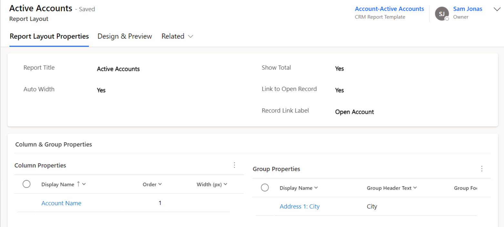
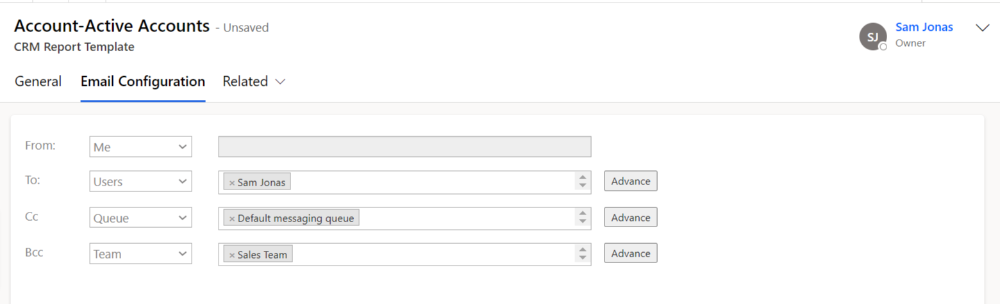

# Email Template (CRM Views Data)

**Email template** pertains to particular **‘VIEWS’** i.e. **All Accounts**, **My Active Accounts**, etc. This option enables you to embed the data of records of any selected view in tables within email body and send it to respective recipients.  It does not adhere to a record or set of records.

This section will guide you through the process of creating **CRM Report Template** for **Email Template**.

In order to create Email Template navigate to **Click2Export App** --> **CRM Templates** --> **New.**

### **General:**

<figure><figcaption></figcaption></figure>

* **Template Type:** Select **‘Email’** template.&#x20;
* **Record Type:** Select any record. Here, **‘Account’** is selected. Once record is selected a new field **‘View’** will appear.&#x20;
* **View:** Select respective **‘View’**. Here, **‘My Active Accounts’** view is selected.&#x20;
* **Template Name:** It is automatically populated once **‘Record Type’** and **‘View’** is selected.&#x20;
* **Auto Send Email:** Enable the field if you want to auto send emails and save it.&#x20;
* **Default Email Template:** If necessary, select any default email template and save the template.&#x20;

### **Report Layout:**&#x20;

This field appears only after saving the template. Here, new report layout can be created. Now, duly fill the following fields and save it.

<figure><figcaption></figcaption></figure>

* **Report Title:** Give name to the report that is to be displayed at the top of table (in email body). You can also use date in the report title. For example, **My Active Report {now|"MM/dd/yyyy"}.**&#x20;
* **Show Total:** Select yes or no. If you enables this, then total row will be visible in table.&#x20;
* **Auto Width:** If this field is set to **'Yes'** then **width** for all columns will be set as **'auto'** i.e. the column width will  depend upon the content of column. This setting will override the width which is specified in column property or selected view. If it is set to **'No'** then width of column will be set as per the **column property** and if this is also not created then width will be taken from **View**.&#x20;
* **Link to Open Record:** If this field is set to 'Yes' then **'Record Link'** column will be visible in table otherwise it will be hidden.&#x20;
* **Record Link Label:** Give appropriate name to the column. Here, if the field is kept blank then by default the column name will be taken as **'Record Link'.**&#x20;

### **Column Properties:**&#x20;

Here, the column properties can be customized as per requirement. You can select the column, its width, alignment, aggregation, etc.

* **Display Name:** Give appropriate display name for the column.&#x20;
* **Order:** Here, you can specify the order for columns to set position in exported table.&#x20;
* **Width:** Here, you can set width of column in pixel. It will override the width specified in view.&#x20;
* **Alignment:** This field allows you to change the alignment for column – **Left, Right, and Center.**&#x20;
* **Aggregation:** This field will enable you to summarize or get total of any column. Here, you will get the following options depending upon the field type of selected column - **Count, Min, Max, Average, Sum.** &#x20;
* **Add Hyperlink:** This will make that column to hyperlink of that record. It is available only for **lookup, customer and URL** type of field.&#x20;
* **Visibility:** If this field is set to **'No'** then the column will not be visible in exported table.

### **Group Properties:**

This section allows you to group the data in the table. You can create a maximum of two groups.&#x20;

* **Group Header Text:** Here, you can add text for header of group column.&#x20;
* **Group Footer Text:** In this field you can add text for footer of group column.&#x20;
* **Summary Type:** If this field is set as **'Count'** then count summary will be shown in the table for that group of column.

### Design & Preview:

Now, **'Design & Preview'** tab is where you can change the format of table in terms of **font, color, table background, header, footer, etc.**

Here, you will have 4 themes to choose from - **Default, Green, Orange and Simple Black.** Further, you can also customize the table as per your requirement. If you change anything for any property it will be reflected in preview in real time. So, you can either use below design option or css field is also open. You can **add/remove/update** css in that field.

**CSS Field:**

### Email Configuration:

The next section is **'Email Configuration'**. To know more about this section, please click [here.](https://docs.inogic.com/click2export/configuration/email-configuration)

<figure><figcaption></figcaption></figure>
