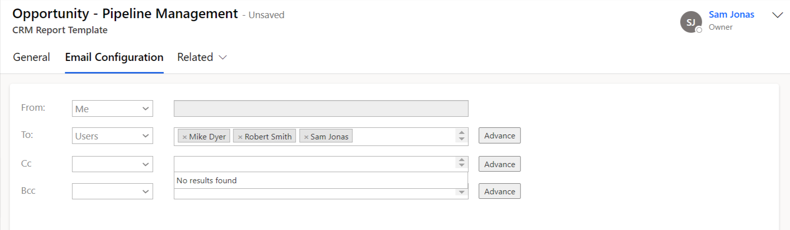

# Excel Template

This section will guide you through the process of creating **CRM Report Template** for **Excel Template**.

* Navigate to **Click2Export App --> CRM Report Templates --> New.**

* Fill the relevant details in the **New CRM Report Template** and save it.

### General:

<figure><figcaption></figcaption></figure>

**Template Type:** Excel Template. If Excel Template is not available. Please enable it from[ here](https://docs.inogic.com/click2export/configuration/click2export-configuration).

**Record Type:** Entity for which you want to create the CRM Report Template.

**Excel Template:** All the excel templates from the document template entity will be available for selection.

**Template Name:** By default this is set to the corresponding report name but is customizable and can be changed. This name is displayed for Report selection in the Click2Export Window and should therefore be unique and easy to identify with especially when you have multiple templates for the same report.

**Default File Format:** Once you select the Excel template type the default file format is set as Excel.

**Export File Name:** This is the name that would be provided to the file generated upon export. You could provide a static name or dynamic name (based on a field of the record).&#x20;

**DateTime Field Format:** This field decides in what format Date & Time should be represented while exporting the report if Export File Name contains a DateTime field. It should have a valid DateTime format for e.g. - **mm/dd/yyyy for 03/23/2021**, **mm/dd/yyyy h:mm tt for 03/23/2021 5:50 AM**. It will reflect the Date & Time field format as Logged-In user’s settings if this field is left blank.

**Auto Send Email:** If enabled, it sends email automatically with the attached exported file, while performing the action from **Click2Export UI** or else it’ll open up the Email Window with all the necessary details populated and then you can hit send manually.

**Default Email Template:** The email would be created based on the default email template specified in that section. If left blank, the Email body would be empty.

### Email Configuration:

The next section is **'Email Configuration'.** To know more about this section, please click [here](https://docs.inogic.com/click2export/configuration/email-configuration).&#x20;

<figure><figcaption></figcaption></figure>


For further queries, reach out to us at [crm@inogic.com](mailto:crm@inogic.com)


