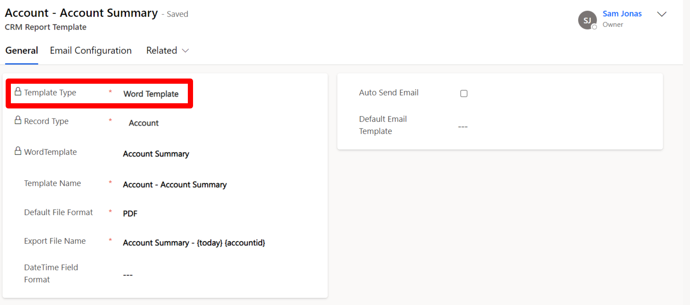
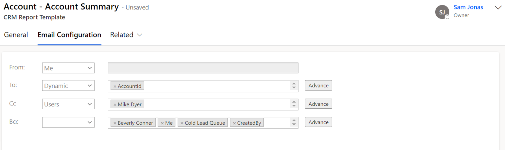

# Word Template

This section will guide you through the process of creating **CRM Report Template** for **Word Templates**.

* Navigate to **Click2Export App > CRM Report Templates > New.**
* Fill the relevant details in the New CRM Report Template.

### General:

<figure><figcaption></figcaption></figure>

**Template Type:** Select Word Template.

**Record Type:** Entity for which you want to create the CRM Report Template.&#x20;

**Word Template:** All the word templates will be available for selection.

**Template Name:** By default this is set to the corresponding report name but is customizable and can be changed. This name is displayed for Report selection in the Click2Export Window and should therefore be unique and easy to identify with especially when you have multiple templates for the same report.

**Default File Format:** For this, two options are available - **PDF & Word**. By default with the solution it is set as **PDF**. With this option you can decide the default format in which the report would be exported.

**Export File Name:** This is the name that would be provided to the file generated upon export. You could provide a static name or dynamic name (based on a field of the record). For eg. **Account Summary – {accountid} – {createdon} - {today}**

This will create a file name as:  **Account Summary – A. Datum Corp – Thursday, 12 February 2015 - Monday, 22 March 2021**

You can use any field name including custom field from the record type provided.

**DateTime Field Format:** This field decides in what format Date & Time should be represented while exporting the report if Export File Name contains a DateTime field. It should have a valid DateTime format for e.g. - **mm/dd/yyyy for 03/23/2021**, **mm/dd/yyyy h:mm tt for 03/23/2021 5:50 AM**. It will reflect the Date & Time field format as Logged-In user’s settings if this field is left blank.

**Auto Send Email:** Send emails automatically with the attached exported file.

**Default Email Template:** The email would be created based on the default email template specified in that section.

### Email Configuration:

The next section is **'Email Configuration'.** To know more about this section, please click [here](https://docs.inogic.com/click2export/configuration/email-configuration).&#x20;

<figure><figcaption></figcaption></figure>
