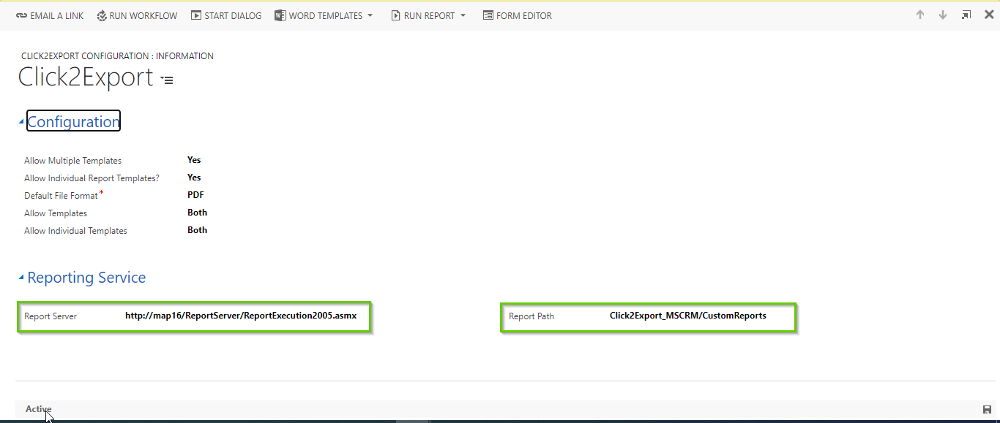

# FAQs

## 1) Can we run scheduling under multiple users at the same time?

Yes, you can do that. For more details, please click [here.](https://docs.inogic.com/click2export/configuration/schedule-reports#scheduled-for)

## 2) We have done a sandbox copy of the production environment to a TEST environment and would like to work with 'Click2Export' solution in this new instance. What should we do?

For this, you need to delete the **Inogic License Details** record from your sandbox environment. After deleting the next step would be to [activate the license](https://docs.inogic.com/click2export/getting-started/license-activation).

To delete the **Click2Eport** license follow the steps given below:

* Navigate to **Advanced Find.**

.jpg>)

* Select **Inogic License Details** in **‘Look for’** --> Click on **Results** button.

.jpg>)

* Select the **Click2Export** record and **delete** it.

## 3) Can I export and send weekly reports?

Yes, using 'Schedule Report' you can create a [schedule job](https://docs.inogic.com/click2export/configuration/schedule-reports) to export and send weekly reports.

## 4) Does Click2Export work for custom entities?

Yes, it works for both OOB and custom entities.

## 5) Can we convert SSRS report to different file formats?

Yes, you can convert it into different file formats such as PDF, Word, Excel, TIFF, CSV.

## 6) When I try to export Word/Excel template report I get the following error:

In order to avoid getting the above mentioned error you have to perform the following action -  ['Set Credentials'](https://docs.inogic.com/click2export/prerequisites/set-credentials). This is a prerequisite for exporting **Word/Excel** templates.

## 7) After importing Click2Export solution from website all the Processes of Click2Export is in a 'Draft/Deactivated' state. What to do?

Once the solution is imported, please follow the below steps to activate all the processes of Click2Export.

* Click on the **gear icon** --> Select **Advanced Settings**.&#x20;

* Next, select **Processes**.

* From **'All Process'** View activate the process shown in the below screenshot:

## 8) What to do when we get error while uploading exported files to SharePoint?

While uploading exported files to SharePoint online from Dynamics 365 On-premise there are chances of facing the following error - **'Exited from GenerateReportOnPremise. Error: The permissions granted to user 'INT\\\<USER URL>-ASYNC' are insufficient for performing this operation. ---> Microsoft.ReportingServices.Diagnostics.Utilities.AccessDeniedException: The permissions granted to user 'INT\\\<USER URL>-ASYNC' are insufficient for performing this operation..'**&#x20;

In such a situation please ensure the correct server URL is provided while leveraging Click2Export's [Upload to SharePoint](https://docs.inogic.com/click2export/configuration/click2export-configuration) functionality.&#x20;

