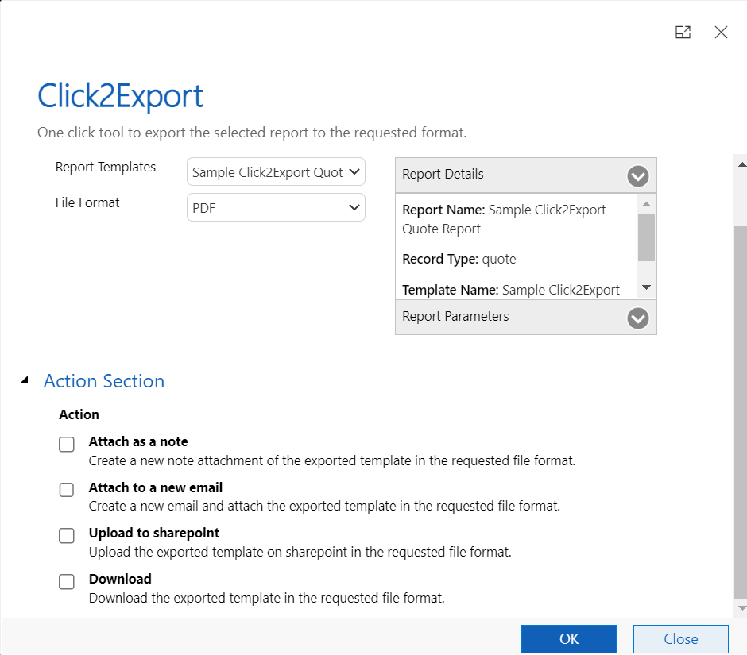

# Action & Email Section

Click2Export allows users to perform the following four different actions with the exported reports:

<figure><figcaption></figcaption></figure>

**Attach as a Note:** If it is enabled then the exported file will be attached a Note against the record. This is only available for **SSRS Reports** and **Word Templates**.

**Attach to a new email:** If it is enabled, then the exported file will be attached to a new email.

* **Choose Template:** This will be populated based on what you have chosen at the time of creating CRM Report Template. You can change the template before exporting the file.&#x20;
* **Auto Send Email:** If this is enabled, then the newly created email will be directly sent to the recipients configured in the Email Section.

**Upload to SharePoint:** If it is enabled then the exported file will be uploaded to SharePoint against the respective record’s folder. This is only available for **SSRS Reports** and **Word Templates**.

**Download:** If it is enabled then the exported file will be downloaded.


**Note: For 'Email Templates' only 'Attach to a new mail' action is supported.**


### Email Section

<figure><figcaption></figcaption></figure>

The values for **Email Section** are **prepopulated** based on what is selected at the time creating **CRM Report Templates.**

The users are also **allowed** to make changes before the file is exported.

