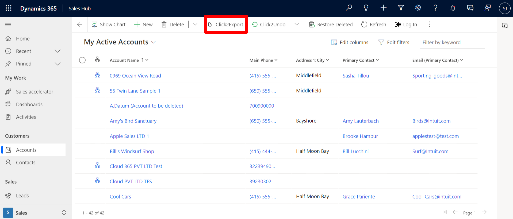
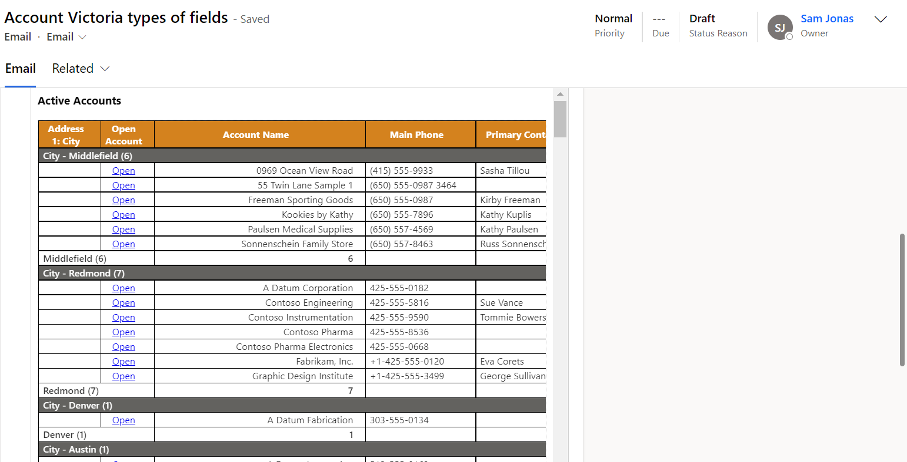

# Export Email Template (CRM Views Data)

> **Schedule and send CRM views data in different table layouts via email to the configured recipients. Set up a quick** [**demo**](https://www.inogic.com/product/productivity-apps/click-2-export-microsoft-dynamics-crm-reports) **with our experts to export Dynamic 365 CRM templates and views in just one click.**

Email Templates can be exported for a View. Go to the entity for which you have configured Email Template and click on **Click2Export** button.

<figure><figcaption></figcaption></figure>

* The options for entity will be listed specific to the **Views** for which **Email Templates** have been created. Select the configured **View** you want to export --> Click on **OK.**

.png>)

* Once export is complete a confirmation message will pop-up.

* Here, you can see the email window with email drafted along with the **View** details in **tabular form**.

<figure><figcaption></figcaption></figure>

You can read more about **Action and Email** Section from [here.](https://docs.inogic.com/click2export/features/action-and-email-section)


For further queries, reach out to us at [crm@inogic.com](mailto:crm@inogic.com)

