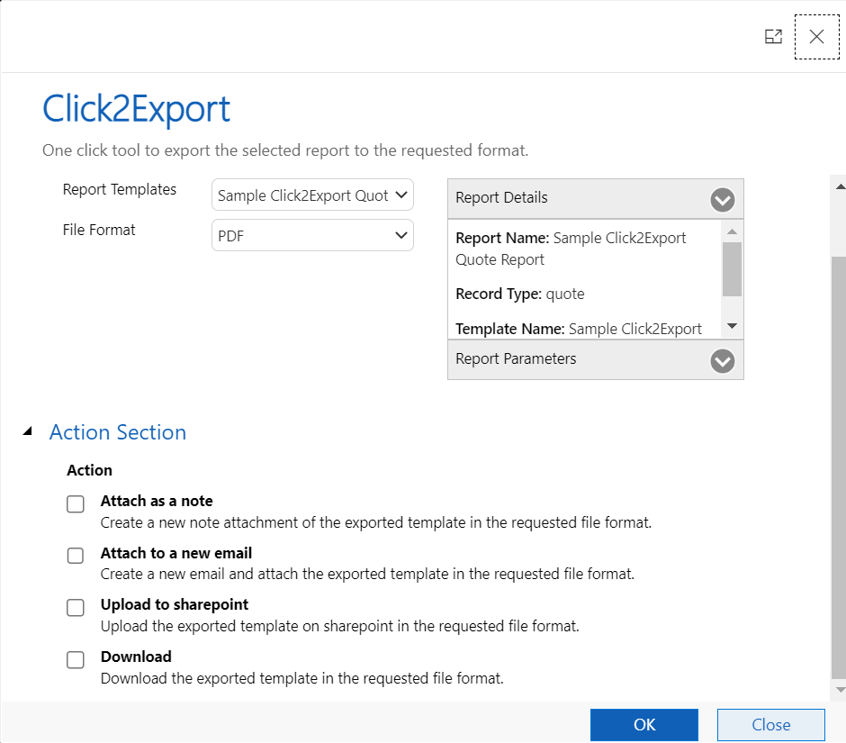

# Export Word Template

Before you could leverage Export Word Template feature, you need to create a CRM Report Template for a Word Template. In case you have not already created, kindly follow the steps provided [here](https://docs.inogic.com/click2export/configuration/templates/word-template).&#x20;

Once a CRM Report Template is created, you can go to the respective entity for which the template has been created and start using Export Word Template feature.&#x20;

Below are the steps that needs to be followed to export Word Template.

* Go to **home page** --> Select any **single record** --> Click on **Click2Export** button.

#### OR

* Open **any record** --> Click on **Click2Export** button.

* The following **Click2Export UI** will open.

<figure><figcaption></figcaption></figure>

**Report Templates:** This is where you will have to select the CRM Report Template for the Word Template that you would want to export.

**File Format:** This is where you can select the format in which you would like to export your Word Template. Currently, Word Template can be exported in Word and PDF formats.

You can read more about **Action and Email** Section from [here.](https://docs.inogic.com/click2export/features/action-and-email-section)


For further queries, reach out to us at [crm@inogic.com](mailto:crm@inogic.com)


