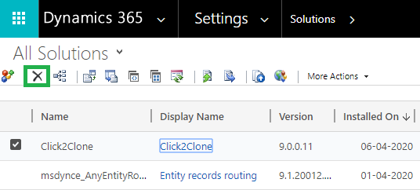

# Install from AppSource

To install Click2Export solution from the Microsoft AppSource, visit the [link](https://appsource.microsoft.com/en-us/product/dynamics-365/inogic.ee5e7d77-c818-43b0-a216-7d5f1c63f1ad?tab=Overview) and follow the steps shown below.&#x20;

* Click on the 'FREE TRIAL' button.

.png>)

* If the user is already logged into CRM, accept the terms & conditions and click on 'Continue'.

* If the user is not logged into CRM, fill in the credentials and Sign in.

* Next, confirm the details in the form, accept the terms & conditions and click on 'Continue'.

* Select an environment from the dropdown list given and then accept the privacy policies & legal terms. Proceed to the installation by clicking on the **Install** button.

.png>)

* The installation process will now have started and you can check the status by refreshing the page.

* After the installation is done, you will be able to see **Click2Export** solution in 'My apps'.&#x20;

