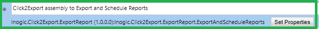

# Uninstallation

Please follow the below steps to uninstall Click2Export from your Dynamics 365 CRM environment.

**Step 1:** Remove **Click2Export assembly** from your workflows.

If you’ve used Click2Export assembly in your workflow, remove the assembly from your workflow.

If you are not using Click2Export assembly, then start from Step 2. 

**Step 2:** Navigate to **Settings -> Solution -> Select Click2Export solution**

.png>)

**Step 3:** Click on **delete** button.

.png>)

 **Step 4:** Click on **OK** button.

.png>)

After clicking on OK your solution will be successfully uninstalled.
