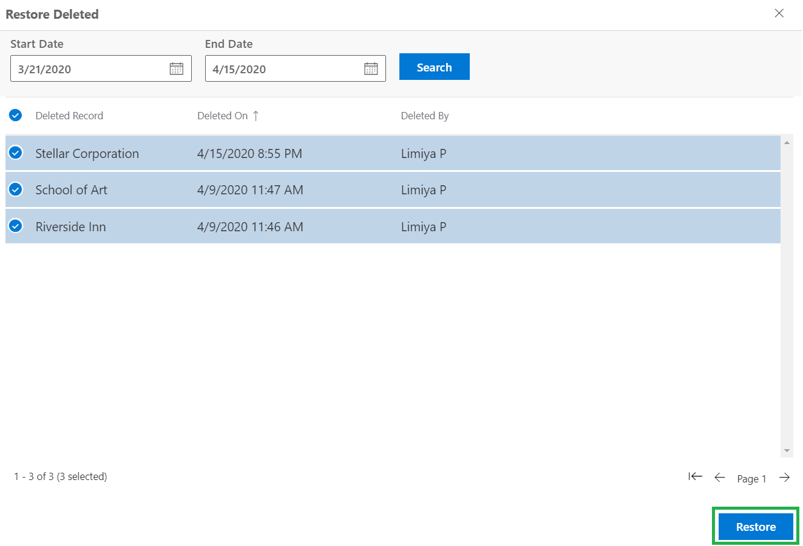

# Restore Deleted Records

> ### _This feature to restore deleted records is part of our Dynamics 365 CRM_
>
> ### _1-click app_ [_Undo2Restore_](https://bit.ly/3H1u0YB)_!_

Sometimes, it happens that you may delete a record by mistake and find that there is no way to restore it. In such situations, this feature allows you to restore that deleted record. For this feature to function it is a must to [enable entities](https://docs.inogic.com/click2undo/configuration/enable-entities) for Undo2Restore solution.&#x20;


**Note: 'Restore Deleted' button is visible to users with System Administrator role and  Undo2Restore Administrator role.**


Here are the steps to restore deleted records.

* Go to the home page of any enabled entity (for e.g. ‘Accounts’ entity home page) --> Click on the ‘Restore Deleted’ button.

* Here, in the Restore grid you will find all the deleted records pertaining to default period which is defined in [Undo2Restore Configuration](https://docs.inogic.com/click2undo/configuration/click2undo-configuration). You can further search and filter these records by date.

* Select record --> Click on the ‘Restore’ button and the record will be restored.


**Note: Similarly, you can select multiple records and restore all those deleted records at once.**


Similarly, you can also restore deleted records of activity entities like Email entity quite easily. The steps are different but simple to follow.

* Go to Advanced Find --> Look for Email Messages Entity --> Click on the Result button.

* A list of Emails that are available in CRM will be displayed and the 'Restore Deleted' will appear on the ribbon bar.

* Click on the 'Restore Delete' button --> A list of deleted Email entity records will appear -->Click on 'Restore' button to retrieve the deleted Email activity record.


For further queries, reach out to us at [crm@inogic.com](mailto:crm@inogic.com)


&#x20;

