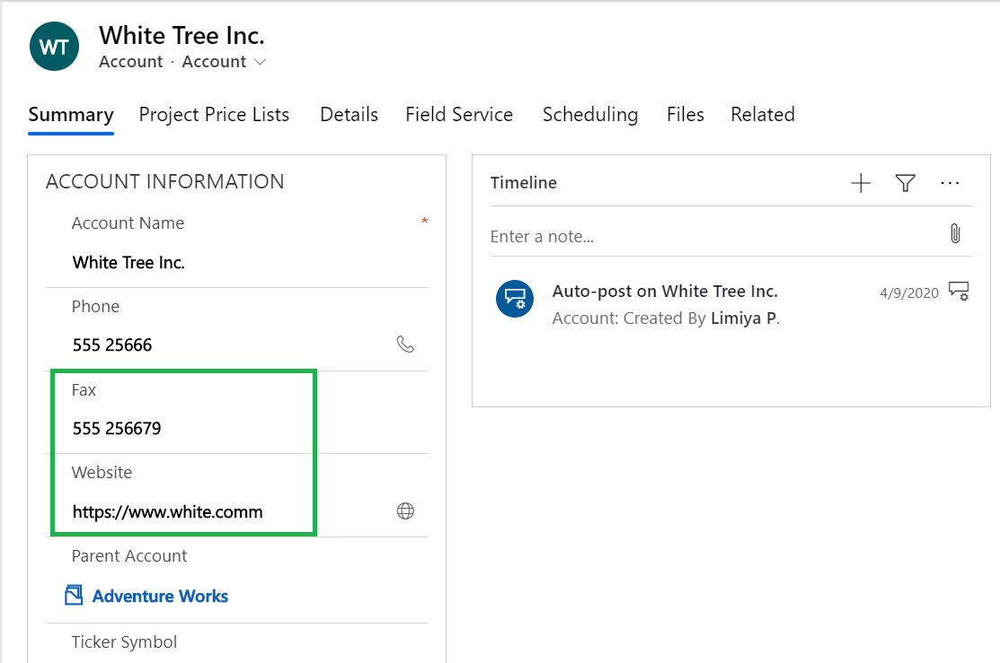
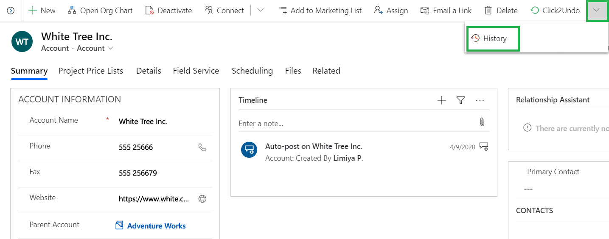
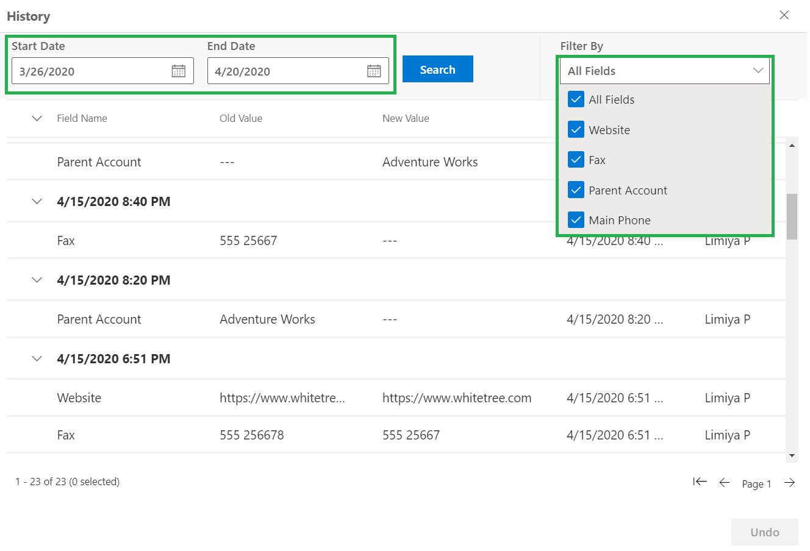
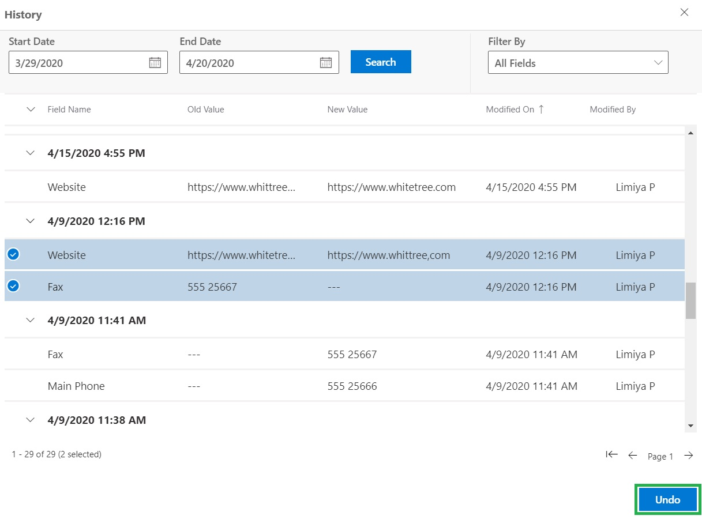
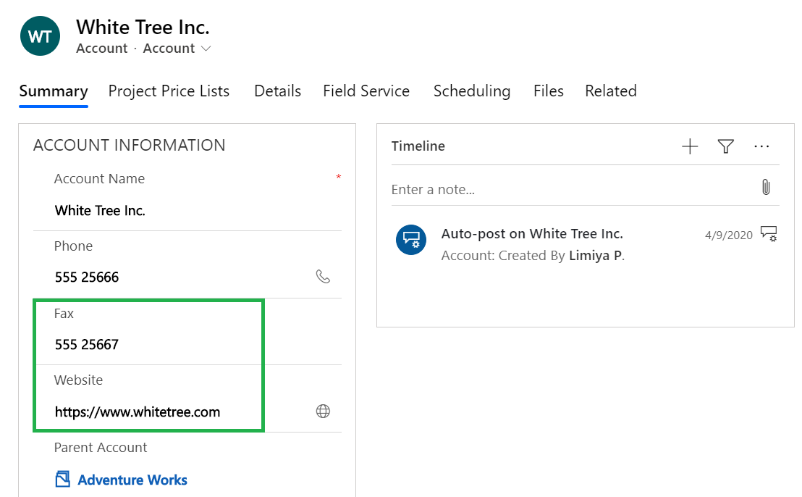

# Restore History Changes

The 'History' button in Click2Undo enables you to restore the past changes made to Dynamics 365 CRM records. In order to restore past changes in the records it is necessary to [enable entities](https://docs.inogic.com/click2undo/configuration/enable-entities) for Click2Undo solution. All the past changes made to the records for a set default period will be displayed in History grid. This default period is defined in [Click2Undo Configuration](https://docs.inogic.com/click2undo/configuration/click2undo-configuration) which can be manually updated. From this displayed list, necessary past changes made to the records can be selected and restored as per requirement.

Here are the steps to restore past changes in Dynamics 365 CRM records.

* Go to any enabled entity (Here, we are taking Accounts entity.) --> Select a record. (In this example, we are going to restore past changes made in Fax & Website fields.)

* Click on the downward arrow near Click2Undo --> Click on History.

* You will get the list of fields changed in the past for which auditing has been enabled.

.png>)

* Further you can filter these changes on the basis of date or fields.

* Now, select the changes you want to restore --> Click on the ‘Undo’ button and the past changes will be restored.

