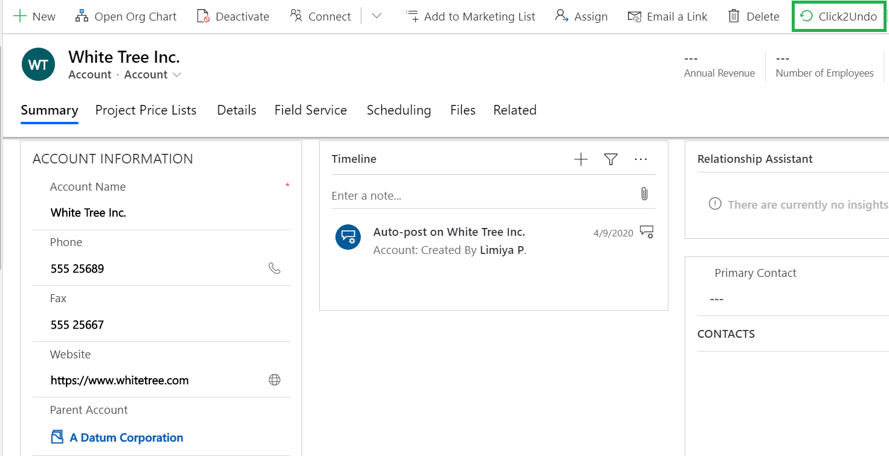
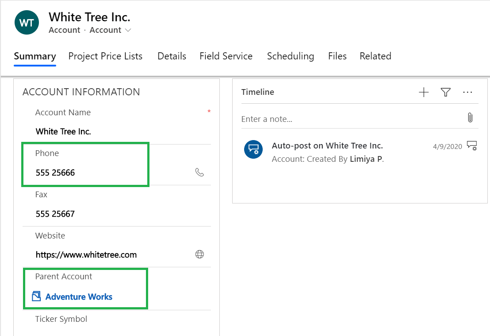

# Undo Changes

The 'Undo' feature of Undo2Restore enables you to undo the last changes made to the Dynamics 365 CRM records. For this feature to function, it is necessary to [enable entities](https://docs.inogic.com/click2undo/configuration/enable-entities) for Undo2Restore solution.

Here are the steps to undo last changes made to Dynamics 365 CRM record.&#x20;

* Go to the record where changes have been made. (In this example, we will undo changes made in Phone & Parent Account fields.)

* Now, click on the Undo2Restore button.

* The last changes made to the record will be undone.


For further queries, reach out to us at [crm@inogic.com](mailto:crm@inogic.com)

