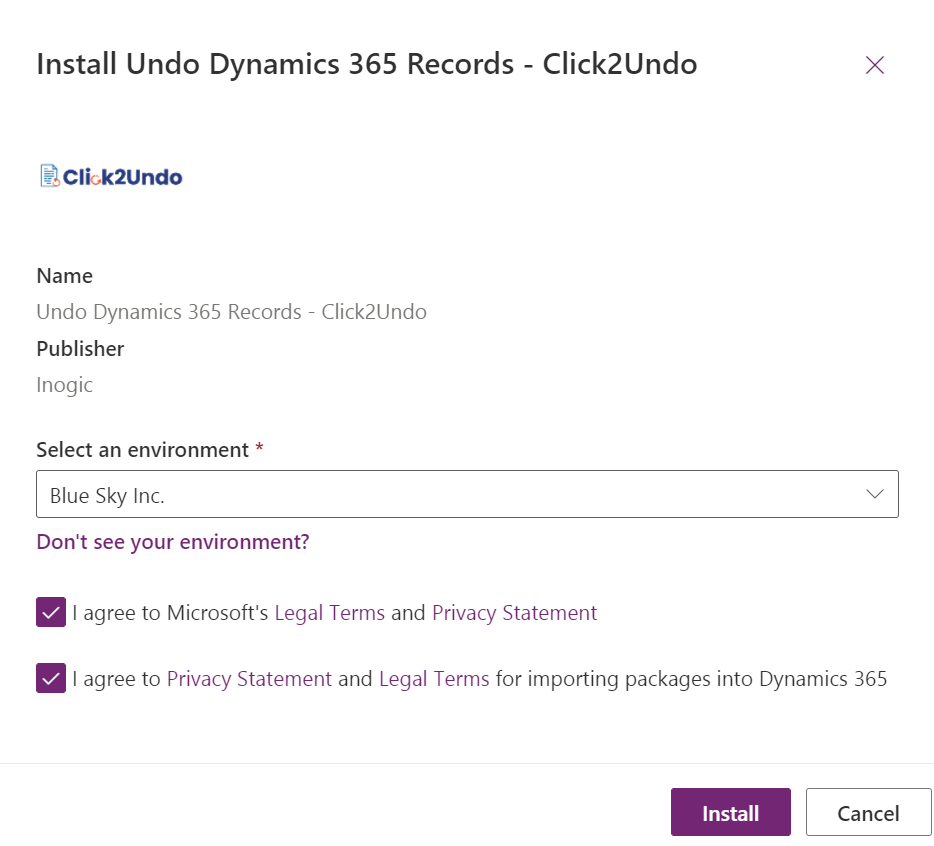
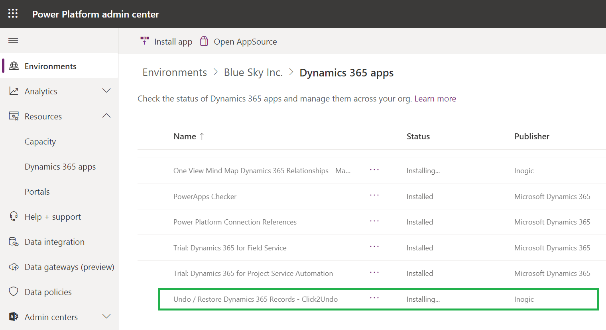

# Install from Microsoft AppSource

To install **Undo2Restore**(Formerly known as Click2Undo) solution from **Microsoft AppSource**, click [here](https://appsource.microsoft.com/en-us/product/dynamics-365/inogic.undo-restore-deleted-dynamics-365-records) and follow the steps given below:&#x20;

* Go to Undo2Restore page on Microsoft AppSource --> Click on the **FREE TRIAL** button.

* If you have already logged into CRM, accept the terms & conditions --> Click on **Continue**.

* If you have not logged into CRM, fill in the credentials and **Sign in**.

* Next, confirm the details in the form --> Accept the terms & conditions --> Click on **Continue**.

* Now, select an environment from the dropdown list and accept the privacy policies & legal terms by clicking on the checkboxes --> Click on **Install** to proceed further.

* The installation process will start shortly --> Keep checking the status at regular intervals by refreshing the page.

* Once the installation is completed, **Click2Undo** solution will be visible in **My apps**.&#x20;

