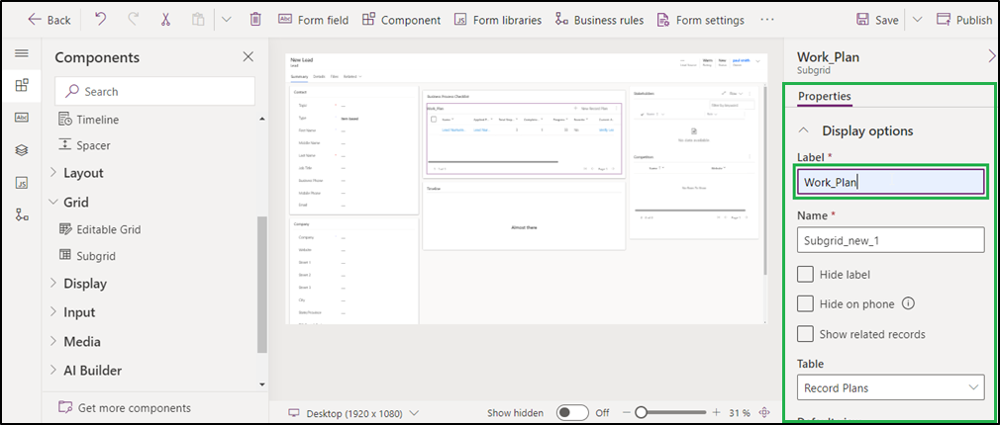

# Install from AppSource

To install **InoLink** solution from the **Microsoft AppSource**, visit the [link ](https://appsource.microsoft.com/en-us/product/dynamics-365/inogic.e320f205-5436-418e-b292-d01417c32312?tab=Overview)and go through the steps shown below.

* Click on the **FREE TRIAL** button.

.png>)

* If the user is already logged into CRM, accept the terms & conditions and click on **Continue**.

.png>)

* If the user is not logged into CRM, fill in the credentials and **Sign in**.

.png>)

* Select your environment from the dropdown list and accept the privacy policies & legal terms. Then click on the **Install** button for the installation to start.

* The installation process will now have started and you can check the status by refreshing the page.

.png>)

* After the installation is done, you will be able to see **InoLink** solution in **My apps**.

