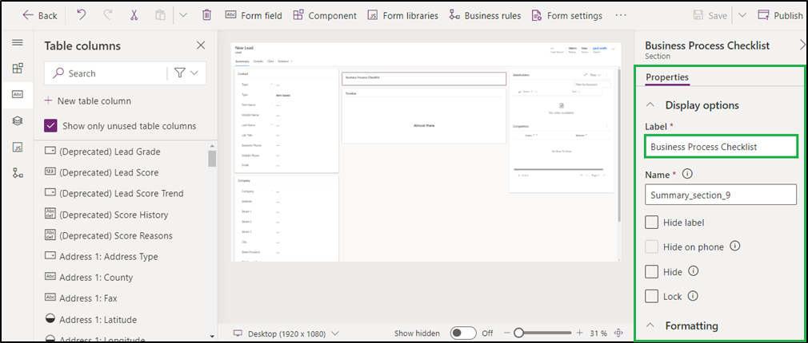

# Configuration for Entity

Kanban Board configuration is quite easy and simple. In this article we will see how to configure **Kanban Board Control** in your Dynamics 365 for an Entity. We will take the example of Case Entity.

* Click on **gear icon** at top right -> Select **Advanced Settings**.

.png>)

* Then go to **Settings ->** **Customizations**

.png>)

* Next click on **Customize the System**

.png>)

* &#x20;Now go to **Components -> Entities -> Select Case -> Click on the last tab – Controls.**

.png>)

* Now click on **Add Control -> Select Kanban Board -> Click on Add.**

.png>)

* The radio button before Kanban Board denotes by default which control is to be loaded for **Case Entity** i.e. CRM OOB Grid (Read-only) or Kanban Board.If you want to display Kanban Board on Web (Computer or laptop devices) then select Web Radio button before Kanban Board. Similarly, you can select Phone or Tablet Radio button to display Kanban Board on Phone or Tablet. Here we have selected all three display modes.

.png>)

* Next, for the field **Lane Filter Criteria** – Select the field based on which Lanes will be categorized. Here, since we are selecting statuscode the list will be created based on **Status Reason** of Case Entity. For example: **In Progress, On Hold , Waiting for details,** etc.

.png>)

.png>)

* Next, for **Row filter criteria** – Select any given field from the dropdown based on which rows will be created. If **Non-OptionSet** field is selected then a **’Drop Zone’** will be available in Kanban view to drag and drop cards from one lane to another to update only the lane.

.png>)

* For **Header** - Select the field value that is to be displayed on header of card. In similar way populate the **Sub-Header** fields.

.png>)

* For **Body Text 1** - Select the field name whose value is to be displayed on the body of the card. Similarly, select the field values for **Body Text 2 & Body Text 3.**


**Note: The selected field should be present on the entity form.**


.png>)

* For **Default Sorting Attribute** - Select any field value based on which cards will be sorted in order.

* For **Aggregate Field 1** – Select any fields with numeric, decimal or currency datatype. For example, budget amount, actual value, exchange rate, etc. Similarly, select the field values for Aggregate Field 2 & Aggregate Field 3.

* For **Aggregate Field Type 1** – Select either Sum, Max, Min or Avg. Based on this, the aggregate value of the above chosen fields will be represented on lane and row headers in the Kanban View. If a value is not selected, then 'SUM' will be taken as default value. Similarly, select the values for Aggregate Field Type 2 & Aggregate Field Type 3.

* For **Default Sorting Direction** - Select either Ascending or Descending.

* For **Business Process Flow** – Select either ‘Y’ (default setting) or ‘N’. This field will provide you Kanban view of records as per the various Business Process Flows available in Case entity.

.png>)

* For **Activity Name** - Enter **up to 3 Activity type** entity logical name that you want to display on card. Now you have to just click on these icons to create activities from Kanban Board.

* For **Card Collapse** - Enter the default card mode to display the details of records. (Y for collapsed mode and N for expanded mode). If the field is left blank then cards will be displayed in default expanded mode.

* For **Row Collapsed** - Enter the default card mode to display the details of records in rows. (Y for collapsed mode and N for expanded mode). If the field is left blank then rows will be displayed in default mode i.e. expanded mode.

* Given below is the example of Kanban Board configuration for Case entity.

.png>)

* After filling all the details, the next step is to save the configuration and then finally publish it.

* Your control will be now displayed on grid as follows:

1. With Lane filter & Row Grouping based on OptionSet field (Priority), you will get the following view:

2\. With Lane filter & Row Grouping based on Non-OptionSet field (Owner), you will get the following view:

3\. With Business Process Flow, you will get the following view:

.png>)

.png>)

4\. With Aggregate Fields, you will get the following views:

_Aggregate field values displayed on **Lane header**_

.png>)

_Aggregate field values displayed on **Row header**_

.png>)

If you didn’t select any of the Radio Buttons, then for viewing Kanban Board you would have to navigate to **Case entity grid -> Click on ellipses -> Select ‘Show As’ -> Click on Kanban Board.**

.png>)

And if you have selected web radio button before Kanban, then to switch back to default grid you would have to follow same step as mentioned above. But this time you would have to select **Read Only Grid.**

