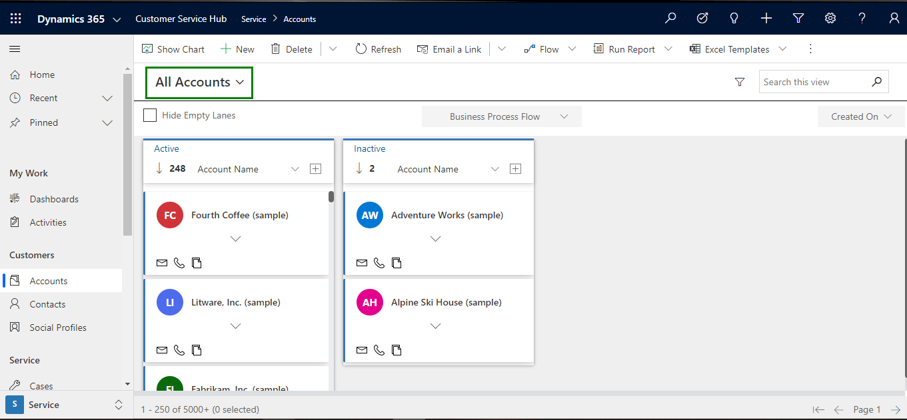

# Configuration for Specific View

You can make Kanban Board available for certain views in an Entity. This is possible by adding Data-set Control on Entity Views.

To add Kanban Board Control on Entity Views follow the steps given below:

* Go to **Settings -> Customizations**.

.png>)

* &#x20;From there go to **Customize the System -> Entities**

.png>)

* Next, click on any Entity, for e.g. **‘Account’ -> Views -> Click on any view,** for e.g. ‘All Accounts’.

.png>)

* In that click on **‘Custom Controls’ -> ‘Add Control’**

.png>)

* Here a list of Data-set control will be displayed. Select the respective Data-set Control that you want to add i.e. **‘Kanban Board’ -> Click on ‘Add’.**

.png>)


**Added control will be available for this view only and not for all views.**


* Next enable Kanban Board for **Web, Phone** and **Tablet.**

.png>)

* Now it will be shown to only the specific view ‘**All Accounts.’**

