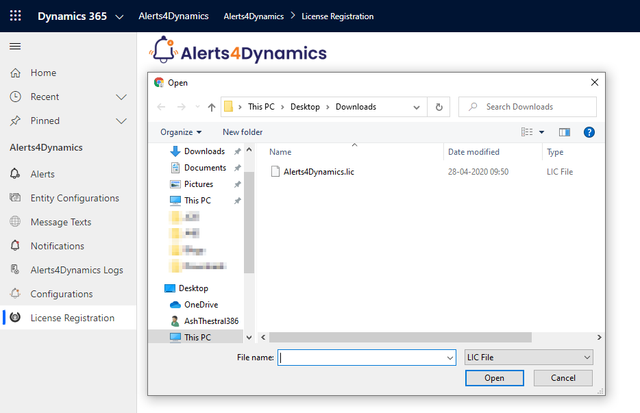

# Configuration for Subgrid

You can make Kanban Board available for subgrid. This is possible by adding Kanban Control on forms.

To add Kanban Board Control on Subgrid follow the steps given below:

* Go to **Settings -> Customizations**.

.png>)

* &#x20;From there go to **Customize the System -> Entities**

* Next, click on any Entity, for e.g. **‘Account’ --> Form --> Select ‘Account’.**

* Here, add new tab on the form.

* Now select the tab --> Click on **‘Change Properties’** --> Go to **‘Display’** --> Select the required details.

* Next go to **‘Controls’** --> Enable **Kanban Board** for **Web, Phone and Tablet.**

* Now it will show the related cases of a particular record in **Kanban View.**

