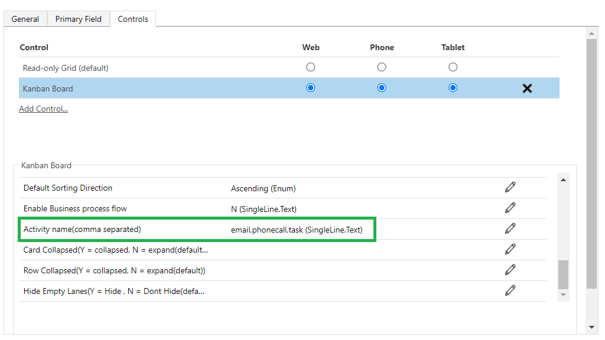

# Quick Activity Actions

Support to define quick activity actions for the records.

Each card supports defining of up to 3 quick activity actions. You can create the activity record defined in a single click from this view.

The quick create form that shows up comes pre-populated with the reference to the said record already set.

The activities to be supported can be defined in the configuration screen when setting up the component for a view as shown in the screenshot below.

Make sure to type in the schema name of the activity types. You can also choose a custom activity type here.
