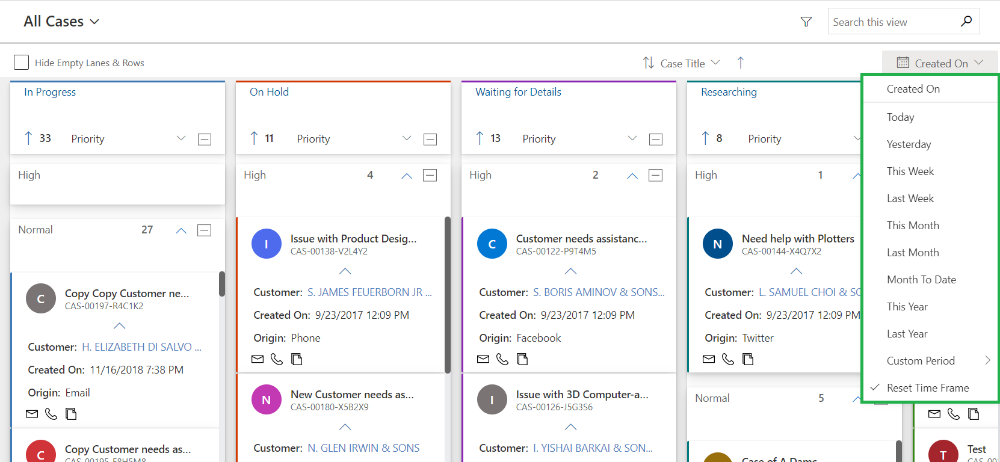

# Sort and Filter Records

Records in the lanes can be sorted. It also supports filtering of the data in the view by “CreatedOn” date.

The Kanban Board supports the ability to sort the cards in ascending or descending order of the field selected. You will be allowed to sort the cards based on the fields used in the card view.

In addition to the quick search option, it also supports filtering of the records based on the “CreatedOn” date.


For further queries, reach out to us at [crm@inogic.com](mailto:crm@inogic.com)

