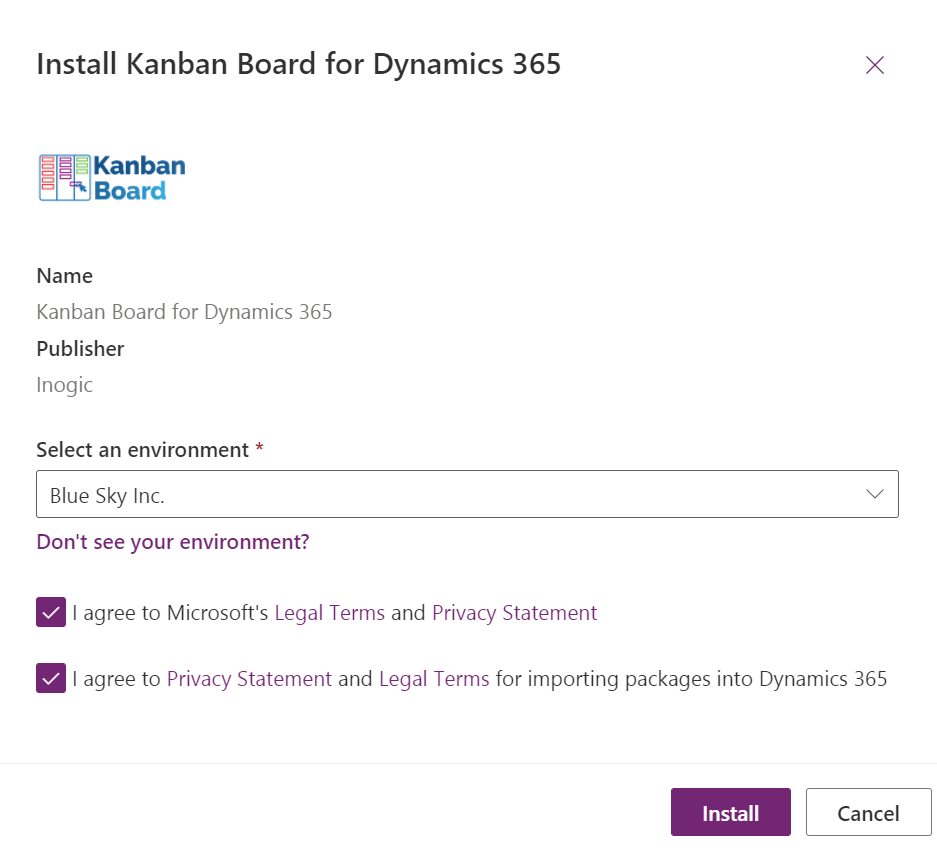
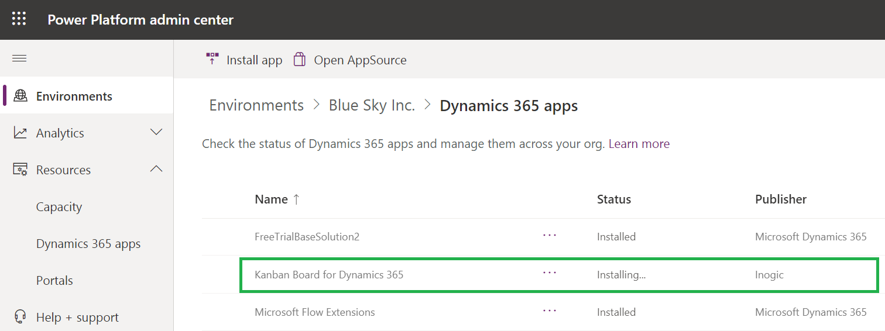

# Install from AppSource

To install Kanban Board solution from **Microsoft AppSource**, visit the [link](https://appsource.microsoft.com/en-us/product/dynamics-365/inogic.kanban-board-dynamics-365-crm?tab=Overview) and follow the steps shown below.

* Click on the '**FREE TRIAL**' button.

* If the user is already logged into CRM, accept the terms & conditions and click on '**Continue**'.

* If the user is not logged into CRM, fill in the credentials and **Sign in**.

* Next, confirm the details in the form, accept the terms & conditions and click on '**Continue**'.
* After selecting an environment from the dropdown list, accept the privacy policies & legal terms and click on **Install** to proceed further.

* The installation process will now have started and you can check the status by refreshing the page.

After the installation is done, you will be able to see Kanban Board solution in '**My apps**'.


For further queries, reach out to us at [crm@inogic.com](mailto:crm@inogic.com)


