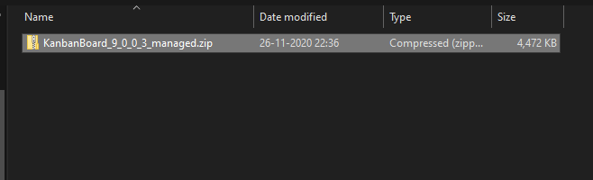
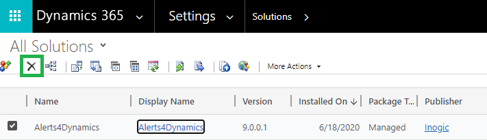

# Install from Website

**Kanban Board** can be installed from our website in two different ways as shown below:

### Using Power Apps UI

To import the solution from make.powerapps.com, download the Kanban Board solution from our [website](https://www.inogic.com/product/productivity-apps/kanban-board-dynamics-365-crm). Then follow the steps as shown below:

* Sign in to [Power Apps](https://make.powerapps.com/?utm\_source=padocs\&utm\_medium=linkinadoc\&utm\_campaign=referralsfromdoc). After signing in, select the instance on which you want to install the solution.

.png>)

* From the left navigation, click on **Solutions** as shown below.

.png>)

* Click on **Import** on the command bar.

.png>)

* &#x20;On the **Import a solution** page, select **Browse** to locate the previously downloaded compressed (.zip) file that contains the solution.

.png>)

* Select **Next**.

.png>)

* Then click on **Import**.

* Your solution will get imported. To check the status of the installation, refresh the page.

### Using Classic UI

For the installation of Kanban Board solution, download the solution from the [Website](https://www.inogic.com/product/productivity-apps/kanban-board-dynamics-365-crm) and then import the managed solution to your CRM environment.&#x20;

Follow the steps to **import** and **install** Kanban Board solution.

For importing and installing the Kanban Board solution in your Dynamics 365 CRM navigate to **Advanced Settings.**

.png>)

&#x20;Go to **Settings → Solutions**

.png>)

Click on **Import** button.

.png>)

You can now browse and upload your solution for importing.

Check **Enable any SDK message processing steps included in the solution** and click on **Import**.

.png>)

The solution will be imported in your environment.

Now, if you want to upgrade the solution to its latest version or reinstall the same solution, then you will get the following dialog box. Here, select the highlighted **'Upgrade'** point and the **'Overwrite customizations'** point for installing the latest solution. And for reinstalling the same solution, just select the **'Overwrite customizations'** point. Lastly, click on **Import** to start the installation process.&#x20;

Once you are done installing the solution in your environment the next step would be to activate the license.
